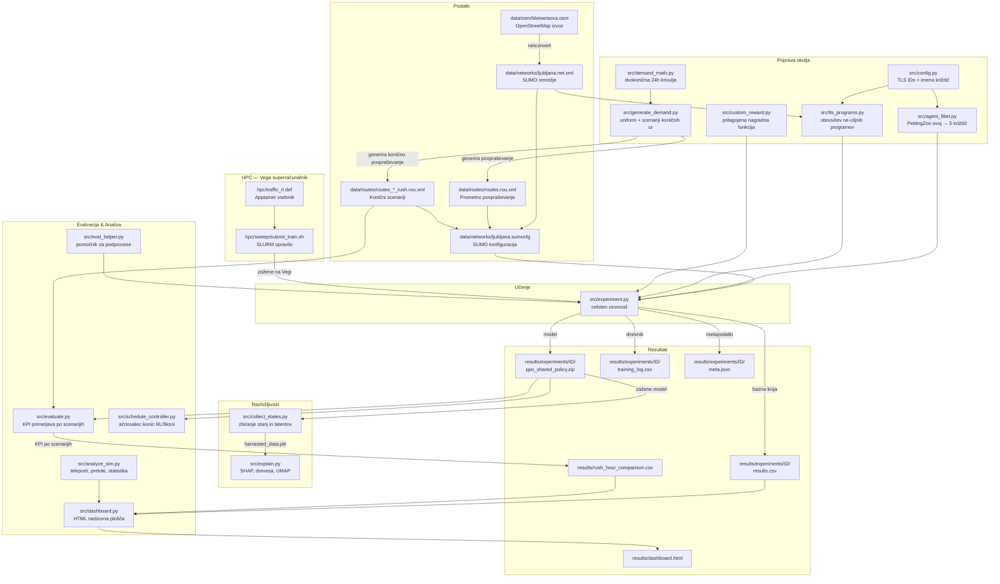

# Zeleni SignaLJ

**Optimizacija semaforjev z umetno inteligenco za Ljubljano**

Arnes HackathON 2026 | Ekipa Ransomware

[](https://doi.org/10.5281/zenodo.19462105)

## Pregled

Agenti s spodbujevalnim učenjem (neodvisni PPO z deljeno politiko), učeni v simulatorju SUMO, za optimizacijo krmiljenja semaforjev v ljubljanskem Bleiweisovem trikotniku — območju zlivanja Tržaške, Celovške in Dunajske ceste.

## Ciljno območje

Zaradi kompleksnosti optimizacije večjega območja smo se osredotočili na optimizacijo le 5 križišč. Želimo narediti prototip, ki dokaže, da se promet lahko optimizira, seveda bi pa v realnosti naredili optimizacijo na nivoju območja.

Opazujemo sledeča križišča:
1. **Tivolska / Slovenska / Dunajska / Trg OF** (Kolodvor)
2. **Bleiweisova / Tivolska / Celovška / Gosposvetska** (Pivovarna)
3. **Slovenska / Gosposvetska / Dalmatinova** (Slovenska)
4. **Aškerčeva / Prešernova / Groharjeva** (Tržaška)
5. **Aškerčeva / Zoisova / Slovenska / Barjanska** (Aškerčeva)


Preostalih 32 semaforjev v omrežju ohranja izvorne SUMO programe (fiksne cikle iz .net.xml), kar zagotavlja pošteno primerjavo z bazno linijo.

## Podatki o območju

Podatki o cestnem omrežju so pridobljeni iz OpenStreetMap (ODbL licenca).

**Okvir (bounding box):**
| Stran | Koordinata |
|-------|------------|
| Sever | 46.05840 |
| Jug | 46.04540 |
| Zahod | 14.49385 |
| Vzhod | 14.50687 |

**Vir:** [OpenStreetMap Export](https://www.openstreetmap.org/export)

Podatke je mogoče ponovno prenesti z Overpass API:
```bash
wget -O data/osm/map.osm \
  "https://overpass-api.de/api/map?bbox=14.49385,46.04540,14.50687,46.05840"
```

## Hiter začetek

```bash
# 1. Namestitev SUMO
sudo add-apt-repository ppa:sumo/stable
sudo apt-get update && sudo apt-get install -y sumo sumo-tools sumo-doc
export SUMO_HOME="/usr/share/sumo"

# 2. Ustvarjanje Python okolja
python3 -m venv .venv
source .venv/bin/activate
pip install -r requirements.txt

# 3. Preverjanje namestitve
python -c "import sumo_rl; print('sumo-rl', sumo_rl.__version__)"

# 3b. Pospešitev SUMO (5-8x hitrejše — uporabi libsumo namesto TraCI socketa)
export LIBSUMO_AS_TRACI=1

# 4a. Generiranje enakomerne prometne obremenitve (za testiranje)
python src/generate_demand.py --profile uniform --duration 3600 --peak_vph 800

# 4b. Generiranje prometnih scenarijev koničnih ur (za resno učenje)
python src/generate_demand.py --scenario all
# Ustvari: routes_morning_rush.rou.xml, routes_evening_rush.rou.xml, routes_offpeak.rou.xml

# 5. Učenje — enaka prometna obremenitev (lokalno, 50 epizod ~ 4 min)
python src/experiment.py --episode_count 50 --tag local_50ep

# 5b. Učenje — scenarij jutranje konice (ena pot, lokalno testiranje)
python src/experiment.py --scenario morning_rush --episode_count 50 --tag jutro_50ep

# 5c. Učenje z naključnimi potmi (priporočeno za produkcijo — prepreči preveliko prilagajanje)
python src/generate_demand.py --scenario morning_rush --num_variants 20 --output_dir data/routes/train-morning
python src/experiment.py --scenario morning_rush --episode_count 50 \
    --route_dir data/routes/train-morning --tag jutro_routerand_50ep

# 6. Primerjava rezultatov in nadzorna plošča
python src/experiment.py --compare_only
python src/dashboard.py
# Odpri results/dashboard.html v brskalniku

# 7. Evalvacija modela po vseh scenarijih koničnih ur
python src/evaluate.py --model results/experiments/XXXXX/ppo_shared_policy.zip
python src/evaluate.py --model models/ppo_morning_rush_final.zip --scenario morning_rush

# 8. Razložljivost modela (SHAP, odločitvena drevesa, UMAP)
python src/collect_states.py --model_path results/experiments/XXXXX/ppo_shared_policy.zip \
    --scenario morning_rush --episodes 12
python src/explain.py --data_path results/experiments/XXXXX/harvested_data.pkl
# Odpri results/experiments/XXXXX/explanations/ za slike
```

## Generiranje prometnega povpraševanja (`generate_demand.py`)

Dva načina uporabe: `--profile` za enakomerno testno obremenitev ali `--scenario` za realistične scenarije koničnih ur iz dvokoničnega 24h matematičnega modela (8:00 jutranja + 16:00 večerna konica). Scenariji modelirajo tudi smer prometnega toka: jutranja konica ima 70 % prometa usmerjenega v center, večerna konica pa 70 % iz centra.

```bash
# Enakomerna obremenitev (za dimne teste)
python src/generate_demand.py --profile uniform --duration 3600 --peak_vph 800

# Vsi scenariji koničnih ur naenkrat (priporočeno za resno učenje)
python src/generate_demand.py --scenario all

# Posamezni scenariji
python src/generate_demand.py --scenario morning_rush   # 06:00-10:00, 4h, bimodalna krivulja
python src/generate_demand.py --scenario evening_rush   # 14:00-18:00, 4h, bimodalna krivulja
python src/generate_demand.py --scenario offpeak        # 12:00-13:00, 1h, referenčni scenarij
```

| Parameter | Opis |
|-----------|------|
| `--profile uniform` | Enakomerna obremenitev (za dimne teste) |
| `--scenario` | `morning_rush` / `evening_rush` / `offpeak` / `all` |
| `--duration` | Trajanje simulacije v sekundah (samo `--profile` način) |
| `--peak_vph` | Koničen pretok v vozilih/uro (samo `--profile` način) |
| `--fringe_factor` | Verjetnost izvorov na robovih (privzeto 5.0) |

| Scenarij | Okno | Trajanje | Datoteka |
|----------|------|----------|---------|
| `morning_rush` | 06:00-10:00 | 4 ure | `routes_morning_rush.rou.xml` |
| `evening_rush` | 14:00-18:00 | 4 ure | `routes_evening_rush.rou.xml` |
| `offpeak` | 12:00-13:00 | 1 ura | `routes_offpeak.rou.xml` |

## Učenje (`experiment.py`)

Zažene bazno linijo → učenje → evalvacija → shranjevanje v enem klicu.

```bash
# Osnovna uporaba
python src/experiment.py --episode_count 50 --tag local_50ep

# Scenariji koničnih ur (zahteva routes_morning_rush.rou.xml)
python src/experiment.py --scenario morning_rush --episode_count 100 --tag jutro_100ep
python src/experiment.py --scenario evening_rush --episode_count 100 --tag vecer_100ep

# Nadaljevanje iz kontrolne točke
python src/experiment.py --episode_count 100 --resume results/experiments/XXXXX/ppo_shared_policy.zip

# Curriculum learning — naključni urni rezini čez cel dan
python src/experiment.py --episode_count 200 --curriculum --tag curriculum_200ep

# Curriculum z beleženjem napredka (primerja RL vs bazna linija vsako epizodo)
python src/experiment.py --episode_count 100 --curriculum --log_curriculum --tag curriculum_log

# Vzporedno učenje na več CPE (za HPC)
python src/experiment.py --episode_count 500 --num_cpus 4 --tag hpc_500ep

# Časovna omejitev (npr. 1 ura učenja)
python src/experiment.py --max_hours 1.0 --tag 1h_local

# Surovi timesteps (namesto epizod)
python src/experiment.py --total_timesteps 180000 --tag raw_50ep

# Samo primerjava obstoječih eksperimentov
python src/experiment.py --compare_only
```

| Zastavica | Opis |
|-----------|------|
| `--episode_count N` | Število polnih epizod (1 epizoda = 3600 SB3 korakov) |
| `--total_timesteps N` | Surovo število SB3 korakov |
| `--max_hours H` | Zaustavitev po H urah (stenski čas) |
| `--scenario` | `uniform` / `morning_rush` / `evening_rush` / `offpeak` |
| `--route_dir DIR` | Mapa z več `.rou.xml` datotekami — vsaka epizoda uporabi naključno pot |
| `--reward_fn` | `queue` / `pressure` / `diff-waiting-time` / `average-speed` |
| `--learning_rate F` | Hitrost učenja (privzeto: 1e-3) |
| `--ent_coef F` | Entropijski koeficient (privzeto: 0.05) |
| `--entropy_annealing` | Linearno zmanjšanje entropije od ent_coef do 0.01 |
| `--episodes_per_save N` | Kontrolna točka vsako N epizod (privzeto: 10) |
| `--curriculum` | Naključni urni rezini 24h krivulje |
| `--num_cpus N` | Vzporedni SUMO procesi (za HPC) |
| `--resume PATH` | Nadaljevanje iz obstoječe kontrolne točke |
| `--tag OZNAKA` | Oznaka eksperimenta (za identifikacijo) |

## Evalvacija

Primerja naučen model z bazno linijo (fiksni časi) po treh scenarijih.

```bash
# Evalvacija čez vse tri scenarije
python src/evaluate.py --model results/experiments/XXXXX/ppo_shared_policy.zip

# Samo en scenarij
python src/evaluate.py --model models/ppo_morning_rush_final.zip --scenario morning_rush

# Z vizualizacijo SUMO GUI
python src/evaluate.py --model models/ppo_morning_rush_final.zip --gui

# Samo bazna linija (brez modela)
python src/evaluate.py
```

Izhod: `results/rush_hour_comparison.csv` (primerjava po scenarijih) + `results/comparison_summary.csv` (po križiščih).

## Razložljivost modela (Interpretability)

Dvostopenjski postopek za razlago naučene politike. Najprej zbiramo podatke iz modela, nato generiramo vizualizacije.

### 1. Zbiranje stanj (`collect_states.py`)

Zažene naučen PPO model skozi več epizod in shrani opazovanja, akcije, 64-dimenzionalne aktivacije latentne plasti in metapodatke v `harvested_data.pkl`. Ure dneva so naključne znotraj okna scenarija, kar zagotovi pokritost različnih prometnih obremenitev.

```bash
# Zberi podatke iz modela jutranje konice (ure 6-10h, ustrezne poti)
python src/collect_states.py --model_path results/experiments/XXXXX/ppo_shared_policy.zip \
    --scenario morning_rush --episodes 12

# Zberi podatke iz modela večerne konice (ure 14-18h)
python src/collect_states.py --model_path results/experiments/YYYYY/ppo_shared_policy.zip \
    --scenario evening_rush --episodes 12

# Mega-politika: oba modela s schedule controllerjem (40% jutranja, 40% večerna, 20% ostalo)
python src/collect_states.py --megapolicy \
    --model_morning <jutranji_model>.zip \
    --model_evening <vecerni_model>.zip \
    --episodes 12 --output_dir results/megapolicy_explain/
# -> results/megapolicy_explain/harvested_data_megapolicy.pkl
```

| Parameter | Opis |
|-----------|------|
| `--model_path` | Pot do naučenega PPO modela (.zip) |
| `--scenario` | `morning_rush` / `evening_rush` / `offpeak` / `uniform` — nastavi datoteko poti in razpon ur |
| `--episodes` | Število epizod za zbiranje (privzeto 12, priporočeno 10-15) |
| `--output_dir` | Izhodna mapa (privzeto: mapa modela) |
| `--megapolicy` | Način mega-politike: uporabi oba modela z načrtovalcem |
| `--model_morning` | Pot do jutranjeega modela (samo `--megapolicy`) |
| `--model_evening` | Pot do večernega modela (samo `--megapolicy`) |

### 2. Generiranje razlag (`explain.py`)

Iz zbranih podatkov generira tri vrste vizualizacij. Vsa križišča so označena s čitljivimi imeni (Kolodvor, Pivovarna, Slovenska, Trzaska, Askerceva), izhodne datoteke pa so opisno poimenovane (npr. `kolodvor-decision-tree.png`).

```bash
python src/explain.py --data_path results/experiments/XXXXX/harvested_data.pkl
# -> results/experiments/XXXXX/explanations/
```

#### Nadomestno odločitveno drevo (Policy Distillation)

Za vsako od 5 križišč prilagodimo plitvo odločitveno drevo (globina 4) kot **človeku berljiv nadomestek** nevronske politike PPO.

**Analiza faz:** Skripta analizira dejanske SUMO signalne stanje (nize znakov `GGrrGGrr...` za vsako zeleno fazo) in nadzorovane povezave (kateri pasovi dobijo zeleno v kateri fazi). Povezave so združene po izvorni cesti (pristopni krak križišča), nato razporejene v **smerne skupine** (Smer 1, Smer 2, ...). Vsaka smer predstavlja skupino cest, ki vedno dobijo zeleno skupaj. Listni vozlišči drevesa tako kažejo npr. **"Smer 1 + Smer 3"** namesto neberljivega "Faza 2".

**Notranji vozlišči** prikazujejo pogoje v slovenščini (npr. "Vrsta pas 2 ≤ 0.35", "Gostota pas 0 ≤ 0.12", "sin(čas) ≤ -0.50").

**Pokritost PPO** (fidelity) je prikazana z značko v zgornjem levem kotu — delež akcij, pri katerih se drevo ujema s PPO modelom. Če je pokritost < 60 %, drevo slabo aproksimira politiko.

Drevo uporablja kompakten izris (širina poddreves, ne enakomeren razmik listov), kar ga naredi berljivega brez povečevanja.

Izhod: `{ime}-decision-tree.png` (5 slik, npr. `kolodvor-decision-tree.png`)

#### SHAP atribucija značilk (Feature Attribution)

Uporabimo `TreeExplainer` na nadomestnem drevesu za izračun SHAP vrednosti za vsako opazovano značilko. Imena značilk so prevedena v slovenščino:

| Surovo ime | Prikazano ime |
|------------|---------------|
| `Density_-123456#0_1` | Gostota pas 1 |
| `Queue_-123456#0_2` | Vrsta pas 2 |
| `Phase_0` | Faza 0 |
| `MinGreenPassed` | Min. zelena pretečena |
| `SinTime` / `CosTime` | sin(čas) / cos(čas) |

Beeswarm diagram pokaže, katere značilke najbolj vplivajo na izbiro akcije agenta. To razkrije, ali agent "gleda" na prave pasove in ali čas dneva vpliva na odločanje.

Izhod: `{ime}-shap.png` (5 slik, npr. `trzaska-shap.png`)

#### UMAP projekcija latentnega prostora (Latent Space)

64-dimenzionalne aktivacije skrite plasti PPO mreže projiciramo v 2D z UMAP algoritmom.

**Kako brati UMAP diagrame:**
- Osi (x, y) **nimajo fizikalnega pomena** — sta abstraktni projekciji 64-dimenzionalnega latentnega prostora nevronske mreže. Zato na diagramih ni oznak osi.
- **Bližje točke = podobna notranja stanja mreže.** Če dve prometni situaciji ležita blizu skupaj, ju je PPO model interno reprezentiral podobno — ne glede na to, ali sta iz istega križišča ali ure.
- **Ločeni grozdi = model je naučil ločevati režime.** Jasni barvni grozdi kažejo, da je model razvil različne interne strategije za različne pogoje.
- **Razpršeni diagrami brez grozdov** kažejo, da model ne razlikuje med pogoji v tej dimenziji.

Tri barvanja:
- **Po akciji** (`umap-actions.png`) — ločeni barvni grozdi = model je naučil ločevati različne signalne odločitve v svojem latentnem prostoru
- **Po uri dneva** (`umap-time.png`) — gradient od modre do rdeče = model ločuje jutranje prometne razmere od poznejših; pomešane barve = model ne ločuje po uri
- **Po križišču** (`umap-intersections.png`) — ločeni grozdi po križišču = deljena politika kljub temu razlikuje med lokacijami; pomešani = enako obravnava vsa križišča

### Priporočeno število epizod

| Epizode | Podatkovnih točk | Uporabnost |
|---------|-------------------|------------|
| 3 | ~10.800 | Samo za dimni test — UMAP redek |
| 5 | ~18.000 | Minimalno. Drevesa OK, UMAP redek |
| **10-15** | **~36.000-54.000** | **Priporočeno.** Stabilne SHAP vrednosti, čisti UMAP grozdi |
| 30+ | ~108.000+ | Padajoči donosi; UMAP postane počasen |

10-15 epizod zagotovi dobro pokritost prometnih razmer znotraj okna scenarija (ura je naključna vsako epizodo), kar omogoča zaznavanje prometnih režimov v UMAP projekciji.

## Načrtovalec (Schedule Controller)

`schedule_controller.py` implementira produkcijsko strategijo: RL agent se aktivira samo v koničnih urah, sicer tečejo izvorni SUMO programi.

| Čas | Način |
|-----|-------|
| 00:00-06:00 | Fiksni čas (noč) |
| 06:00-10:00 | RL agent (jutranja konica) |
| 10:00-14:00 | Fiksni čas (poldnevi) |
| 14:00-18:00 | RL agent (večerna konica) |
| 18:00-24:00 | Fiksni čas (večer/noč) |

```python
from schedule_controller import ScheduleController
ctrl = ScheduleController(
    model_morning="models/ppo_morning_rush_final.zip",
    model_evening="models/ppo_evening_rush_final.zip"
)
ctrl.print_schedule()
mode = ctrl.get_mode(hour=7.5)   # -> "rl_morning"
```

## Parametri simulacije

| Parameter | Vrednost | Opis |
|-----------|----------|------|
| `num_seconds` | 3600 + 600 | Trajanje epizode: 600s ogrevanje + 1h RL |
| `delta_time` | 5 | Sekunde med odločitvami agenta (frekvenca akcij) |
| `yellow_time` | 2 | Trajanje rumene faze med preklopom zelene |
| `min_green` | 10 | Minimalen čas zelene faze pred preklopom |
| `max_green` | 90 | Maksimalen čas zelene faze pred ponovnim odločanjem |
| `reward_fn` | "queue" | Nagrada = negativno število ustavljenih vozil na korak |
| `WARMUP_SECONDS` | 600 | 10 min mehanske SUMO simulacije pred RL prevzemom |

## PPO hiperparametri

| Parameter | Vrednost | Opis |
|-----------|----------|------|
| `learning_rate` | 0.001 | Korak gradientnega posodabljanja |
| `n_steps` | 720 | Korakov na agenta pred PPO posodobitvijo (= 1 celotna epizoda) |
| `batch_size` | 180 | Velikost mini-serije za gradient (3600 / 180 = 20 serij) |
| `n_epochs` | 10 | Število prehodov čez zbiralnik na posodobitev |
| `gamma` | 0.99 | Diskontni faktor (0=kratkovidno, 1=neskončen horizont) |
| `gae_lambda` | 0.95 | GAE glajenje med pristranskostjo in varianco |
| `ent_coef` | 0.05 | Entropijski bonus — spodbuja raziskovanje |
| `clip_range` | 0.2 | PPO obrezovanje: omejuje spremembo politike na posodobitev |

## Napredno učenje (Curriculum Learning)

Z uporabo zastavice `--curriculum` algoritem naključno vzorči različne ure dneva. Sistem izračuna prometni pretok iz dvokoničnega matematičnega modela (`demand_math.get_vph`): konici ob 8:00 in 16:00, ponoči prazne ceste. Skupno 40.000 vozil/dan (nastavljivo v `config.py` kot `TOTAL_DAILY_CARS`).

Model vsako epizodo vidi drugačen scenarij in se tako nauči splošnih pravil za različne prometne obremenitve. Z `--log_curriculum` dobimo podroben zapis napredka (primerjava RL vs. bazna linija za vsako epizodo) v `curriculum_progress.txt`.

## Razumevanje korakov (timesteps)

En "korak" (timestep) v SB3 = 5 sekund simuliranega prometa za 1 semafor. Ker je 5 semaforjev vektoriziranih prek SuperSuit, SB3 prišteje 5 korakov na vsak SUMO korak.

```
1 epizoda = num_seconds / delta_time * num_agents
         = 3600 / 5 * 5 = 3600 SB3 korakov

n_steps = 720 → 720 * 5 agentov = 3600 korakov = točno 1 epizoda na PPO posodobitev
```

| `--episode_count` | SB3 koraki | Polnih epizod | PPO posodobitev |
|-------------------|------------|---------------|-----------------|
| 10 | 36.000 | 10 | 10 |
| 50 | 180.000 | 50 | 50 |
| 100 | 360.000 | 100 | 100 |
| 500 | 1.800.000 | 500 | 500 |

## Arhitektura cevovoda



## Struktura projekta

```
zeleni-signalj/
├── data/
│   ├── osm/              # Surovi OSM izvlečki
│   ├── networks/         # SUMO .net.xml datoteke
│   ├── routes/           # Prometno povpraševanje .rou.xml
│   └── gtfs/             # LPP avtobusni podatki (neobvezno)
├── src/
│   ├── experiment.py         # Celoten eksperiment (bazna linija → učenje → evalvacija)
│   ├── evaluate.py           # Multi-scenarij evalvacija (morning/evening/offpeak)
│   ├── run_24h.py            # 24h simulacija z dinamicnim RL/fiksni cas preklapljanjem
│   ├── run_rush_test.py      # Izoliran test generalizacije konicnih ur (50 poti x model)
│   ├── config.py             # ID-ji križišč, parametri simulacije, PPO hiperparametri
│   ├── agent_filter.py       # PettingZoo ovoj za filtriranje na 5 križišč
│   ├── tls_programs.py       # Obnovitev izvornih SUMO programov za neopazovana križišča
│   ├── custom_reward.py      # Prilagojene nagradne funkcije
│   ├── demand_math.py        # Dvokonična 24h prometna krivulja (get_vph)
│   ├── generate_demand.py    # Generiranje povpraševanja (uniform + scenariji + full_day)
│   ├── schedule_controller.py  # Načrtovalec: RL v konicah, fiksni čas drugače
│   ├── eval_helper.py        # Pomočnik za evalvacijo v podprocesih (curriculum)
│   ├── collect_states.py      # Zbiranje stanj in latentnih aktivacij iz naučenega modela
│   ├── explain.py             # Razložljivost: SHAP, odločitvena drevesa, UMAP
│   ├── analyze_sim.py         # Analiza SUMO izhoda (teleporti, pretoki)
│   └── dashboard.py           # HTML nadzorna plosca (9 zavihkov: scenariji, mega-politike, generalizacija, razlozljivost)
├── hpc/
│   ├── common.sh             # Skupna HPC nastavitev (venv, SUMO_HOME)
│   ├── traffic_rl.def        # Apptainer definicija vsebnika
│   ├── sweep/                # Hiperparametrsko iskanje (48 SLURM skript)
│   │   ├── generate_jobs.py  # Generator SLURM skript
│   │   ├── submit_all.sh     # Oddaja z dvofaznim cevovodom (poti → učenje)
│   │   ├── gen_train_routes.slurm  # Generiranje 100+100 ucnih poti (faza 1)
│   │   └── *.slurm           # Posamezne ucne skripte (faza 2)
│   └── statistical-test/     # Statisticno testiranje (24h mega-politike + konicni testi)
│       ├── generate_mega_jobs.py  # Generator 11 SLURM skript (50 ponovitev + generiranje poti)
│       ├── generate_rush_jobs.py  # Generator konicnih testov (3+3 modelov + 2 bazni liniji)
│       ├── submit_all.sh          # Oddaja mega-politik
│       ├── submit_rush.sh         # Oddaja konicnih testov
│       ├── gen_routes.slurm       # Generiranje 50 prometnih poti za mega-politike
│       ├── gen_routes_morning_rush.slurm  # Generiranje 50 poti za jutranji test
│       ├── gen_routes_evening_rush.slurm  # Generiranje 50 poti za vecerni test
│       ├── mega_*.slurm           # 9 mega-politik + 1 bazna linija
│       └── rush_*.slurm           # 6 modelov + 2 bazni liniji (konicni testi)
├── models/               # Shranjeni modeli (kontrolne točke)
├── logs/                 # Dnevniki učenja
└── results/
    ├── experiments/      # Rezultati po eksperimentih
    │   └── <run_id>/     # meta.json, results.csv, ppo_shared_policy.zip
    │       └── checkpoints/  # ppo_policy_10ep.zip + .json, ppo_policy_20ep.zip + .json, ...
    ├── statistical-test/ # Rezultati 24h statisticnih testov (50 ponovitev x 10 pogojev)
    │   ├── M1E1/         # meta.json + 50x run_seed_*.json + summary.csv
    │   ├── ...           # M1E2, M1E3, M2E1, ..., M3E3
    │   └── baseline/     # Bazna linija (sami fiksni casi)
    ├── rush-test/        # Rezultati testov generalizacije konicnih ur
    │   ├── M1_morning/   # meta.json + 50x run_seed_*.json + summary.csv
    │   ├── ...           # M2_morning, M3_morning, E1_evening, ..., E3_evening
    │   ├── baseline_morning/  # Bazna linija (jutranja konica)
    │   └── baseline_evening/  # Bazna linija (vecerna konica)
    ├── rush_hour_comparison.csv  # KPI primerjava po scenarijih konicnih ur
    ├── comparison_summary.csv    # KPI po posameznih kriziscih
    └── dashboard.html    # Interaktivna nadzorna plosca (9 zavihkov)
```

## Tehnologije

- **SUMO 1.26.0** — mikroskopski prometni simulator (DLR)
- **sumo-rl 1.4.5** — PettingZoo ovoj za SUMO (več-agentno)
- **stable-baselines3 2.8.0** — implementacija PPO algoritma
- **SuperSuit 3.9+** — vektorizacija PettingZoo okolja za SB3
- **HPC Vega** (IZUM) — superračunalnik za učenje z večjim številom epizod

## HPC eksperimenti

### Iskanje 1 (zaključeno): Učenje na eni poti

Prvo iskanje: 24 konfiguracij x 200 epizod na 128 CPE-jih. Modeli so se učili na eni sami prometni poti na scenarij. Najboljši modeli so dosegli 12–18 % izboljšanje na učni poti, vendar niso posplošili na nevidene prometne vzorce (potrjeno s testi generalizacije koničnih ur: -15 % do -27 % poslabšanje na naključnih poteh).

### Iskanje 2 (v teku): Učenje z naključnimi potmi

48 SLURM skript v `hpc/sweep/`, generirane z `hpc/sweep/generate_jobs.py`. Vse uporabljajo `--route_dir` s 100 naključnimi prometnimi potmi na scenarij, da preprečijo preveliko prilagajanje na izvorno-ciljne pare (OD-pair overfitting).

**Matrika eksperimentov:**
- 3 nagradne funkcije: `queue`, `pressure`, `diff-waiting-time`
- 3 hitrosti učenja: `3e-3`, `1e-3`, `3e-4`
- 2 scenarija: `morning_rush`, `evening_rush`
- Entropy annealing variante (vseh 18 kombinacij)
- Iskanje entropijskega koeficienta (`ent_coef` = 0.02, 0.05, 0.1 za `pressure`)
- 300 epizod, 24h časovna omejitev, 128 CPE-jev

**Dvofazni cevovod:**
1. `gen_train_routes.slurm` — generira 100 jutranjih + 100 večernih prometnih poti
2. Vseh 48 učnih skript počaka na poti, nato teče vzporedno

**Kontrolne točke:** Vsako 10. epizodo se shrani `ppo_policy_10ep.zip`, `ppo_policy_20ep.zip` itd. z metapodatki (`.json`). Tudi ob prekinitvi se shrani `ppo_model_latest.zip`.

```bash
# Oddaj vse (generiranje poti + učenje)
bash hpc/sweep/submit_all.sh

# Preskoči generiranje poti (če poti že obstajajo)
bash hpc/sweep/submit_all.sh --skip-routes

# Filtriraj po ključni besedi
bash hpc/sweep/submit_all.sh pressure
bash hpc/sweep/submit_all.sh morningrush
bash hpc/sweep/submit_all.sh lr1e3
bash hpc/sweep/submit_all.sh entanneal

# Spremljaj status
squeue -u $USER
```

## Izbor najboljših politik in mega-politike

Po izvedbi 24 eksperimentov na HPC (3 nagradne funkcije x 2 hitrosti učenja x 2 scenarija + entropy annealing variante) smo na podlagi nadzorne plošče izbrali **3 najboljše politike za jutranjo konico** in **3 najboljše za vecerno konico** glede na izboljsanje % nad bazno linijo (fiksni casi).

### Najboljse politike — jutranja konica (06:00-10:00)

| Rang | Nagradna funkcija | Hitrost ucenja | Izboljsanje |
|------|-------------------|----------------|-------------|
| M1 | diff-waiting-time | 1e-3 | **+18.2%** |
| M2 | pressure | 1e-3 | **+17.2%** |
| M3 | queue (privzeta) | 3e-4 | **+17.1%** |

### Najboljse politike — vecerna konica (14:00-18:00)

| Rang | Nagradna funkcija | Hitrost ucenja | Entropy annealing | Izboljsanje |
|------|-------------------|----------------|-------------------|-------------|
| E1 | pressure | 1e-3 | da | **+15.1%** |
| E2 | diff-waiting-time | 1e-3 | da | **+15.0%** |
| E3 | pressure | 3e-4 | da | **+12.9%** |

### Mega-politike (3 x 3 = 9 kombinacij)

Mega-politika kombinira eno jutranjo in eno vecerno politiko z nacrtovalcem (Schedule Controller):
- **V konicnih urah** (06:00-10:00, 14:00-18:00): RL agent (PPO model) krmili 5 ciljnih kriziscc
- **Izven konic** (10:00-14:00, 18:00-06:00): vsa kriziscca teccejo na izvornih SUMO fiksnih ccasih

To daje 9 mega-politik: M1E1, M1E2, M1E3, M2E1, M2E2, M2E3, M3E1, M3E2, M3E3.

## Statisticno testiranje (24h simulacije)

Za statisticno veljavno primerjavo mega-politik z bazno linijo izvajamo **50 ponovitev** vsake mega-politike na polnih 24-urnih simulacijah z zasnovo **parnih primerjav** (matched-pairs design).

### Zasnova testa (parni pari)

- **10 pogojev:** 9 mega-politik + 1 bazna linija (sami fiksni casi)
- **50 ponovitev** na pogoj, vsaka z unikatnim SUMO semenom (1-50)
- **Razlicne prometne poti za vsako seme:** `routes_full_day_seed_00.rou.xml` do `seed_49.rou.xml` — generirane z razlicnimi semeni v `randomTrips.py`, kar daje razlicne izvorno-ciljne pare ob ohranjanju istega dvokonicnega prometnega profila
- **Parno primerjanje:** za vsako seme N vsi pogoji (bazna linija + 9 mega-politik) uporabijo isto datoteko poti — razlike izhajajo izkljucno iz strategije krmiljenja
- **Polni 24h dvokonicni profil** z usmerjeno asimetrijo (70% vhodni promet zjutraj, 70% izhodni zvecer)

### Dinamicno preklapljanje RL/fiksni cas (`run_24h.py`)

24h simulacija tece kot en neprekinjen SUMO okolje (86400 sekund). Na vsakem koraku skripta preveri uro simulacije in preklopi ciljne semaforje med RL in fiksnim casom:

| Cas | Nacin | Opis |
|-----|-------|------|
| 00:00-06:00 | Fiksni cas | Obnovljen izvorni SUMO program |
| 06:00-10:00 | RL (jutranji model) | PPO agent krmili 5 krizisc |
| 10:00-14:00 | Fiksni cas | Obnovljen izvorni SUMO program |
| 14:00-18:00 | RL (vecerni model) | PPO agent krmili 5 krizisc |
| 18:00-24:00 | Fiksni cas | Obnovljen izvorni SUMO program |

**Pomembno:** Ob preklopu na fiksni cas se poklice `setProgramLogic()` za obnovitev faz **in** `setProgram()` za ponoven zagon avtomaticnega cikliranja. Brez `setProgram()` bi semaforji obticsali na eni fazi (ena smer stalno zelena), ker `setRedYellowGreenState()` iz sumo-rl postavi semafor v rocni nacin. Ta popravek je potreben na dveh mestih:
1. **Ciljni semaforji** (`run_24h.py`, `_switch_to_fixed_time`) — ob preklopu iz RL v fiksni cas
2. **Neciljni semaforji** (`tls_programs.py`, `restore_non_target_programs`) — ob inicializaciji okolja, ko sumo-rl zamenja programe vseh 37 semaforjev. Brez `setProgram()` je 32 neciljnih semaforjev obticsalo celotno 24-urno simulacijo, kar je povzrocilo -187% degradacijo v nocnem oknu (00:00-06:00).

### Merjene metrike (na ponovitev)

- Skupna kumulativna nagrada (vsa krizisca, vsi casovni koraki)
- Nagrada, povprecna cakalna vrsta in cakalni cas **po kriziscu** (5 krizisc)
- Razdelitev **po casovnem oknu** (noc, jutranja konica, dnevni obok, vecerna konica, vecerni obok)
- Skupni teleporti, vozila odsla/prispela

### Statisticna analiza (parni testi)

Iz 50 parnih ponovitev izracunamo za vsako mega-politiko:
- **Povprecje, mediana, standardni odklon** razlik (mega - bazna)
- **95% interval zaupanja** (t-porazdelitev)
- **Parni t-test** (`ttest_rel`) — primerja istosemenske pare
- **Wilcoxon test** predznacenih rangov — neparametricni parni test
- **Cohenov d** za parne podatke: `d = povprecje(razlike) / std(razlike)`

Parni testi so mocnejsi od neodvisnih, ker eliminirajo varianco prometnih poti (isti promet za bazno linijo in mega-politiko pri vsakem semenu).

### Zagon

```bash
# 1. Generiraj 50 razlicnih prometnih poti (enkrat, ~100 min)
python src/generate_demand.py --statistical_routes 50
# -> data/routes/statistical-test/routes_full_day_seed_00..49.rou.xml

# 2. Generiraj SLURM skripte (1 generiranje poti + 10 simulacij)
python hpc/statistical-test/generate_mega_jobs.py

# 3. Oddaj vse na HPC (najprej generira poti, nato simulacije)
bash hpc/statistical-test/submit_all.sh

# 3b. Preskocci generiranje poti (ce ze obstajajo)
bash hpc/statistical-test/submit_all.sh --skip-routes

# 4. Rezultati: results/statistical-test/{M1E1,...,baseline}/summary.csv

# 5. Generiraj nadzorno plosco z zavihkom Mega-politike
python src/dashboard.py
```

### Ocenjen cas na HPC

| Operacija | Cas |
|-----------|-----|
| Generiranje 50 prometnih poti | ~100 min |
| Ena 24h simulacija | ~10-20 min |
| 50 ponovitev (50 vzporednih delavcev, 64 CPE) | ~30-50 min |
| Skupaj na opravilo (z varnostno rezervo) | 8h (zahtevano) |
| Vseh 10 opravil (vzporedno) | ~1h stenske ure |

## Nadzorna plosca (Dashboard)

Interaktivna HTML nadzorna plosca (`results/dashboard.html`) s 6 zavihki:

```bash
python src/dashboard.py --no-prompt
# Odpri results/dashboard.html v brskalniku
```

| Zavihek | Vsebina |
|---------|---------|
| **Primerjava** | Primerjava vseh eksperimentov: bazna linija vs RL, izboljsanje %, filtriranje |
| **Krizisca** | Razdelitev po 5 kriziscih: nagrada, izboljsanje %, trendi |
| **Ucenje** | Krivulje ucenja (epizode in koraki) za izbrane eksperimente |
| **Hiperparametri** | Razsevni diagrami (koraki vs. izboljsanje, LR vs. izboljsanje), tabela |
| **Podrobnosti** | Metapodatki in hiperparametri posameznega eksperimenta |
| **Mega-politike** | Statisticna primerjava 9 mega-politik z bazno linijo (100 ponovitev) |

### Zavihek Mega-politike

Zavihek se prikaze samodejno, ko obstajajo rezultati v `results/statistical-test/`. Vsebuje:

- **KPI kartice** — stevilo pogojev, najboljsa/najslabsa mega-politika, stevilo ponovitev, znacilnost
- **Primerjava skupne nagrade** — stolpcni diagram z 95% intervali zaupanja
- **3x3 toplotna karta** — jutranji model (M1-M3) x vecerni model (E1-E3), barvno kodirano, z zvezdicami znacilnosti (`*/**/***`)
- **Primerjava po kriziscih** — skupinski stolpci za nagrado in izboljsanje po 5 kriziscih
- **Primerjava po casovnih oknih** — skupinski stolpci za 6 casovnih oken
- **Tabela statisticne znacilnosti** — Welchov t-test, Mann-Whitney U, Cohenov d, p-vrednosti
- **Podrobnosti mega-politike** — per-krizisce in per-okno statistika za izbrano politiko

Statisticni testi se izracunajo v Pythonu (numpy, scipy) in vlozijo kot JSON v HTML.

## Vizualizacija in demo

Nacrt za pripravo koncne predstavitve za sodnike hackathona.

### Rezultati in nadzorna plosca
- [x] Zazeni eksperimente na HPC z razlicnimi nagradnimi funkcijami
- [x] Prenesi rezultate iz Vege (`results/experiments/`)
- [x] Generiraj nadzorno plosco: `python src/dashboard.py`
- [x] Preveri zavihke: primerjava, krizisca, ucne krivulje, hiperparametri
- [x] Zavihek Mega-politike za statisticno primerjavo

### Vizualizacija prometa
- [ ] Zaženi najboljši model v SUMO GUI: `python src/evaluate.py --gui --model <pot_do_modela>.zip --scenario morning_rush`
- [ ] Posnimi 30-sekundni video zaslona SUMO GUI kot rezervo (ffmpeg ali OBS)
- [ ] Priprava toplotne karte prometnih čakalnih vrst (baseline vs. RL, po korakih)

### Razložljivost
- [ ] Zberi stanja iz najboljšega modela: `python src/collect_states.py --model_path <pot>.zip --episodes 12`
- [ ] Generiraj razlage: `python src/explain.py --data_path <pot>/harvested_data.pkl`
- [ ] Preglej odločitvena drevesa: katera značilka (pas, faza, čas) poganja odločitve?
- [ ] Preglej SHAP diagrame: ali agent "gleda" na prave pasove?
- [ ] Preglej UMAP projekcije: ali se oblikujejo grozdi po urah / akcijah?

### Predstavitev
- [ ] Kontekstna slika: `data/media/Observed_intersections.png` — 5 križišč na zemljevidu
- [ ] Arhitekturni diagram: Mermaid diagram iz README-ja
- [ ] Nadzorna plošča v živo: odpri `results/dashboard.html`, pokaži zavihke
- [ ] Razložljivost: pokaži odločitveno drevo + UMAP projekcijo za najboljše križišče
- [ ] SUMO GUI demo v živo ALI predposneti video
- [ ] Zaključni diapozitiv: tabela scenarij x nagradna funkcija x izboljšanje %

### Poročilo
- [ ] Metodologija: IPPO z deljeno politiko, 5 križišč, SUMO simulator
- [ ] Rezultati: tabele in grafi iz nadzorne plošče
- [ ] Analiza: katera križišča se izboljšajo, katera ne, zakaj
- [ ] Zaključek: primerjava nagradnih funkcij, priporočila za produkcijo

## Ekipa

- Nik Jenic
- Tian Kljucanin
- Nace Omahen
- Masa Uhan
