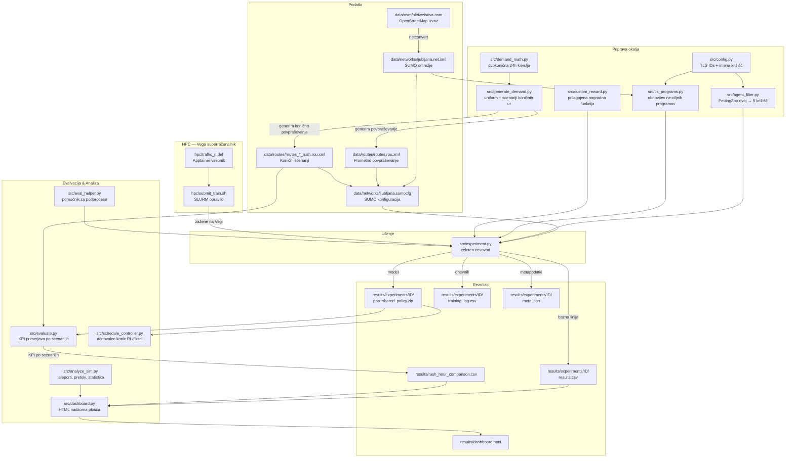

# Zeleni SignaLJ

**Optimizacija semaforjev z umetno inteligenco za Ljubljano**

Arnes HackathON 2026 | Ekipa Ransomware

[](https://doi.org/10.5281/zenodo.19462105)

## Pregled

Agenti s spodbujevalnim učenjem (neodvisni PPO z deljeno politiko), učeni v simulatorju SUMO, za optimizacijo krmiljenja semaforjev v ljubljanskem Bleiweisovem trikotniku — območju zlivanja Tržaške, Celovške in Dunajske ceste.

## Ciljno območje

Zaradi kompleksnosti optimizacije večjega območja smo se osredotočili na optimizacijo le 5 križišč. Želimo narediti prototip, ki dokaže, da se promet lahko optimizira, seveda bi pa v realnosti naredili optimizacijo na nivoju območja.

Opazujemo sledeča križišča:
1. **Tivolska / Slovenska / Dunajska / Trg OF** (Kolodvor)
2. **Bleiweisova / Tivolska / Celovška / Gosposvetska** (Pivovarna)
3. **Slovenska / Gosposvetska / Dalmatinova** (Slovenska)
4. **Aškerčeva / Prešernova / Groharjeva** (Tržaška)
5. **Aškerčeva / Zoisova / Slovenska / Barjanska** (Aškerčeva)


Preostalih 32 semaforjev v omrežju ohranja izvorne SUMO programe (fiksne cikle iz .net.xml), kar zagotavlja pošteno primerjavo z bazno linijo.

## Podatki o območju

Podatki o cestnem omrežju so pridobljeni iz OpenStreetMap (ODbL licenca).

**Okvir (bounding box):**
| Stran | Koordinata |
|-------|------------|
| Sever | 46.05840 |
| Jug | 46.04540 |
| Zahod | 14.49385 |
| Vzhod | 14.50687 |

**Vir:** [OpenStreetMap Export](https://www.openstreetmap.org/export)

Podatke je mogoče ponovno prenesti z Overpass API:
```bash
wget -O data/osm/map.osm \
  "https://overpass-api.de/api/map?bbox=14.49385,46.04540,14.50687,46.05840"
```

## Hiter začetek

```bash
# 1. Namestitev SUMO
sudo add-apt-repository ppa:sumo/stable
sudo apt-get update && sudo apt-get install -y sumo sumo-tools sumo-doc
export SUMO_HOME="/usr/share/sumo"

# 2. Ustvarjanje Python okolja
python3 -m venv .venv
source .venv/bin/activate
pip install -r requirements.txt

# 3. Preverjanje namestitve
python -c "import sumo_rl; print('sumo-rl', sumo_rl.__version__)"

# 4a. Generiranje enakomerne prometne obremenitve (za testiranje)
python src/generate_demand.py --profile uniform --duration 3600 --peak_vph 800

# 4b. Generiranje prometnih scenarijev koničnih ur (za resno učenje)
python src/generate_demand.py --scenario all
# Ustvari: routes_morning_rush.rou.xml, routes_evening_rush.rou.xml, routes_offpeak.rou.xml

# 5. Učenje — enaka prometna obremenitev (lokalno, 50 epizod ~ 4 min)
python src/experiment.py --episode_count 50 --tag local_50ep

# 5b. Učenje — scenarij jutranje konice (priporočeno za produkcijo)
python src/experiment.py --scenario morning_rush --episode_count 50 --tag jutro_50ep

# 5c. Napredno učenje po celem dnevu (Curriculum)
python src/experiment.py --episode_count 50 --curriculum --tag napredno_ucenje

# 6. Primerjava rezultatov in nadzorna plošča
python src/experiment.py --compare_only
python src/dashboard.py
# Odpri results/dashboard.html v brskalniku

# 7. Evalvacija modela po vseh scenarijih koničnih ur
python src/evaluate.py --model results/experiments/XXXXX/ppo_shared_policy.zip
python src/evaluate.py --model models/ppo_morning_rush_final.zip --scenario morning_rush
```

## Generiranje prometnega povpraševanja (`generate_demand.py`)

Dva načina uporabe: `--profile` za enakomerno testno obremenitev ali `--scenario` za realistične scenarije koničnih ur iz dvokoničnega 24h matematičnega modela (8:00 jutranja + 16:00 večerna konica). Scenariji modelirajo tudi smer prometnega toka: jutranja konica ima 70 % prometa usmerjenega v center, večerna konica pa 70 % iz centra.

```bash
# Enakomerna obremenitev (za dimne teste)
python src/generate_demand.py --profile uniform --duration 3600 --peak_vph 800

# Vsi scenariji koničnih ur naenkrat (priporočeno za resno učenje)
python src/generate_demand.py --scenario all

# Posamezni scenariji
python src/generate_demand.py --scenario morning_rush   # 06:00-10:00, 4h, bimodalna krivulja
python src/generate_demand.py --scenario evening_rush   # 14:00-18:00, 4h, bimodalna krivulja
python src/generate_demand.py --scenario offpeak        # 12:00-13:00, 1h, referenčni scenarij
```

| Parameter | Opis |
|-----------|------|
| `--profile uniform` | Enakomerna obremenitev (za dimne teste) |
| `--scenario` | `morning_rush` / `evening_rush` / `offpeak` / `all` |
| `--duration` | Trajanje simulacije v sekundah (samo `--profile` način) |
| `--peak_vph` | Koničen pretok v vozilih/uro (samo `--profile` način) |
| `--fringe_factor` | Verjetnost izvorov na robovih (privzeto 5.0) |

| Scenarij | Okno | Trajanje | Datoteka |
|----------|------|----------|---------|
| `morning_rush` | 06:00-10:00 | 4 ure | `routes_morning_rush.rou.xml` |
| `evening_rush` | 14:00-18:00 | 4 ure | `routes_evening_rush.rou.xml` |
| `offpeak` | 12:00-13:00 | 1 ura | `routes_offpeak.rou.xml` |

## Učenje (`experiment.py`)

Zažene bazno linijo → učenje → evalvacija → shranjevanje v enem klicu.

```bash
# Osnovna uporaba
python src/experiment.py --episode_count 50 --tag local_50ep

# Scenariji koničnih ur (zahteva routes_morning_rush.rou.xml)
python src/experiment.py --scenario morning_rush --episode_count 100 --tag jutro_100ep
python src/experiment.py --scenario evening_rush --episode_count 100 --tag vecer_100ep

# Nadaljevanje iz kontrolne točke
python src/experiment.py --episode_count 100 --resume results/experiments/XXXXX/ppo_shared_policy.zip

# Curriculum learning — naključni urni rezini čez cel dan
python src/experiment.py --episode_count 200 --curriculum --tag curriculum_200ep

# Curriculum z beleženjem napredka (primerja RL vs bazna linija vsako epizodo)
python src/experiment.py --episode_count 100 --curriculum --log_curriculum --tag curriculum_log

# Vzporedno učenje na več CPE (za HPC)
python src/experiment.py --episode_count 500 --num_cpus 4 --tag hpc_500ep

# Časovna omejitev (npr. 1 ura učenja)
python src/experiment.py --max_hours 1.0 --tag 1h_local

# Surovi timesteps (namesto epizod)
python src/experiment.py --total_timesteps 180000 --tag raw_50ep

# Samo primerjava obstoječih eksperimentov
python src/experiment.py --compare_only
```

| Zastavica | Opis |
|-----------|------|
| `--episode_count N` | Število polnih epizod (1 epizoda = 3600 SB3 korakov) |
| `--total_timesteps N` | Surovo število SB3 korakov |
| `--max_hours H` | Zaustavitev po H urah (stenski čas) |
| `--scenario` | `uniform` / `morning_rush` / `evening_rush` / `offpeak` |
| `--curriculum` | Naključni urni rezini 24h krivulje |
| `--log_curriculum` | Beleženje RL vs. bazna linija vsako epizodo |
| `--num_cpus N` | Vzporedni SUMO procesi (za HPC) |
| `--resume PATH` | Nadaljevanje iz obstoječe kontrolne točke |
| `--tag OZNAKA` | Oznaka eksperimenta (za identifikacijo) |

## Evalvacija

Primerja naučen model z bazno linijo (fiksni časi) po treh scenarijih.

```bash
# Evalvacija čez vse tri scenarije
python src/evaluate.py --model results/experiments/XXXXX/ppo_shared_policy.zip

# Samo en scenarij
python src/evaluate.py --model models/ppo_morning_rush_final.zip --scenario morning_rush

# Z vizualizacijo SUMO GUI
python src/evaluate.py --model models/ppo_morning_rush_final.zip --gui

# Samo bazna linija (brez modela)
python src/evaluate.py
```

Izhod: `results/rush_hour_comparison.csv` (primerjava po scenarijih) + `results/comparison_summary.csv` (po križiščih).

## Načrtovalec (Schedule Controller)

`schedule_controller.py` implementira produkcijsko strategijo: RL agent se aktivira samo v koničnih urah, sicer tečejo izvorni SUMO programi.

| Čas | Način |
|-----|-------|
| 00:00-06:00 | Fiksni čas (noč) |
| 06:00-10:00 | RL agent (jutranja konica) |
| 10:00-14:00 | Fiksni čas (poldnevi) |
| 14:00-18:00 | RL agent (večerna konica) |
| 18:00-24:00 | Fiksni čas (večer/noč) |

```python
from schedule_controller import ScheduleController
ctrl = ScheduleController(
    model_morning="models/ppo_morning_rush_final.zip",
    model_evening="models/ppo_evening_rush_final.zip"
)
ctrl.print_schedule()
mode = ctrl.get_mode(hour=7.5)   # -> "rl_morning"
```

## Parametri simulacije

| Parameter | Vrednost | Opis |
|-----------|----------|------|
| `num_seconds` | 3600 + 600 | Trajanje epizode: 600s ogrevanje + 1h RL |
| `delta_time` | 5 | Sekunde med odločitvami agenta (frekvenca akcij) |
| `yellow_time` | 2 | Trajanje rumene faze med preklopom zelene |
| `min_green` | 10 | Minimalen čas zelene faze pred preklopom |
| `max_green` | 90 | Maksimalen čas zelene faze pred ponovnim odločanjem |
| `reward_fn` | "queue" | Nagrada = negativno število ustavljenih vozil na korak |
| `WARMUP_SECONDS` | 600 | 10 min mehanske SUMO simulacije pred RL prevzemom |

## PPO hiperparametri

| Parameter | Vrednost | Opis |
|-----------|----------|------|
| `learning_rate` | 0.001 | Korak gradientnega posodabljanja |
| `n_steps` | 720 | Korakov na agenta pred PPO posodobitvijo (= 1 celotna epizoda) |
| `batch_size` | 180 | Velikost mini-serije za gradient (3600 / 180 = 20 serij) |
| `n_epochs` | 10 | Število prehodov čez zbiralnik na posodobitev |
| `gamma` | 0.99 | Diskontni faktor (0=kratkovidno, 1=neskončen horizont) |
| `gae_lambda` | 0.95 | GAE glajenje med pristranskostjo in varianco |
| `ent_coef` | 0.05 | Entropijski bonus — spodbuja raziskovanje |
| `clip_range` | 0.2 | PPO obrezovanje: omejuje spremembo politike na posodobitev |

## Napredno učenje (Curriculum Learning)

Z uporabo zastavice `--curriculum` algoritem naključno vzorči različne ure dneva. Sistem izračuna prometni pretok iz dvokoničnega matematičnega modela (`demand_math.get_vph`): konici ob 8:00 in 16:00, ponoči prazne ceste. Skupno 40.000 vozil/dan (nastavljivo v `config.py` kot `TOTAL_DAILY_CARS`).

Model vsako epizodo vidi drugačen scenarij in se tako nauči splošnih pravil za različne prometne obremenitve. Z `--log_curriculum` dobimo podroben zapis napredka (primerjava RL vs. bazna linija za vsako epizodo) v `curriculum_progress.txt`.

## Razumevanje korakov (timesteps)

En "korak" (timestep) v SB3 = 5 sekund simuliranega prometa za 1 semafor. Ker je 5 semaforjev vektoriziranih prek SuperSuit, SB3 prišteje 5 korakov na vsak SUMO korak.

```
1 epizoda = num_seconds / delta_time * num_agents
         = 3600 / 5 * 5 = 3600 SB3 korakov

n_steps = 720 → 720 * 5 agentov = 3600 korakov = točno 1 epizoda na PPO posodobitev
```

| `--episode_count` | SB3 koraki | Polnih epizod | PPO posodobitev |
|-------------------|------------|---------------|-----------------|
| 10 | 36.000 | 10 | 10 |
| 50 | 180.000 | 50 | 50 |
| 100 | 360.000 | 100 | 100 |
| 500 | 1.800.000 | 500 | 500 |

## Arhitektura cevovoda



## Struktura projekta

```
zeleni-signalj/
├── data/
│   ├── osm/              # Surovi OSM izvlečki
│   ├── networks/         # SUMO .net.xml datoteke
│   ├── routes/           # Prometno povpraševanje .rou.xml
│   └── gtfs/             # LPP avtobusni podatki (neobvezno)
├── src/
│   ├── experiment.py         # Celoten eksperiment (bazna linija → učenje → evalvacija)
│   ├── evaluate.py           # Multi-scenarij evalvacija (morning/evening/offpeak)
│   ├── config.py             # ID-ji križišč, parametri simulacije, PPO hiperparametri
│   ├── agent_filter.py       # PettingZoo ovoj za filtriranje na 5 križišč
│   ├── tls_programs.py       # Obnovitev izvornih SUMO programov za neopazovana križišča
│   ├── custom_reward.py      # Prilagojene nagradne funkcije
│   ├── demand_math.py        # Dvokonična 24h prometna krivulja (get_vph)
│   ├── generate_demand.py    # Generiranje povpraševanja (uniform + scenariji koničnih ur)
│   ├── schedule_controller.py  # Načrtovalec: RL v konicah, fiksni čas drugače
│   ├── eval_helper.py        # Pomočnik za evalvacijo v podprocesih (curriculum)
│   ├── analyze_sim.py        # Analiza SUMO izhoda (teleporti, pretoki)
│   └── dashboard.py          # Generiranje HTML nadzorne plošče
├── hpc/
│   ├── traffic_rl.def    # Apptainer definicija vsebnika
│   └── submit_train.sh   # SLURM skripta za Vego
├── models/               # Shranjeni modeli (kontrolne točke)
├── logs/                 # Dnevniki učenja
└── results/
    ├── experiments/      # Rezultati po eksperimentih (meta.json, results.csv, model)
    ├── rush_hour_comparison.csv  # KPI primerjava po scenarijih koničnih ur
    ├── comparison_summary.csv    # KPI po posameznih križiščih
    └── dashboard.html    # Interaktivna nadzorna plošča
```

## Tehnologije

- **SUMO 1.26.0** — mikroskopski prometni simulator (DLR)
- **sumo-rl 1.4.5** — PettingZoo ovoj za SUMO (več-agentno)
- **stable-baselines3 2.8.0** — implementacija PPO algoritma
- **SuperSuit 3.9+** — vektorizacija PettingZoo okolja za SB3
- **HPC Vega** (IZUM) — superračunalnik za učenje z večjim številom epizod

## Ekipa

- Nik Jenic
- Tian Kljucanin
- Nace Omahen
- Masa Uhan
