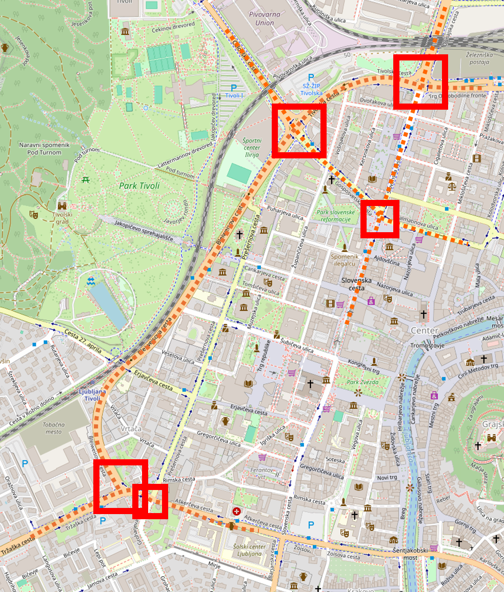
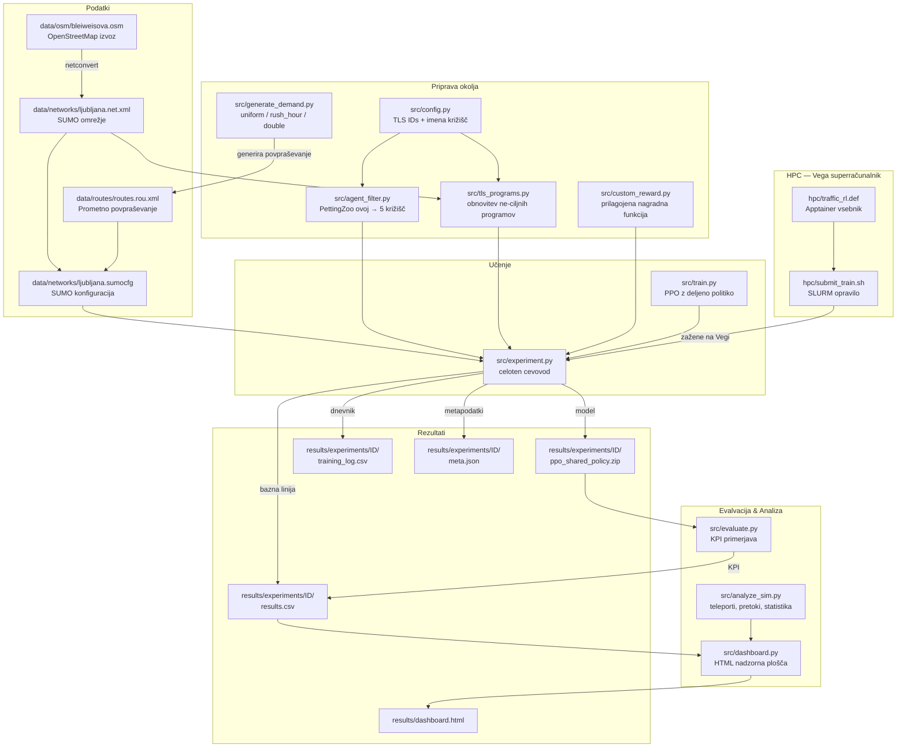

# Zeleni SignaLJ

**Optimizacija semaforjev z umetno inteligenco za Ljubljano**

Arnes HackathON 2026 | Ekipa Ransomware

## Pregled

Agenti s spodbujevalnim učenjem (neodvisni PPO z deljeno politiko), učeni v simulatorju SUMO, za optimizacijo krmiljenja semaforjev v ljubljanskem Bleiweisovem trikotniku — območju zlivanja Tržaške, Celovške in Dunajske ceste.

## Ciljno območje

Zaradi kompleksnosti optimizacije večjega območja smo se osredotočili na optimizacijo le 5 križišč. Želimo narediti prototip, ki dokaže, da se promet lahko optimizira, seveda bi pa v realnosti naredili optimizacijo na nivoju območja.

Opazujemo sledeča križišča:
1. **Tivolska / Slovenska / Dunajska / Trg OF** (Kolodvor)
2. **Bleiweisova / Tivolska / Celovška / Gosposvetska** (Pivovarna)
3. **Slovenska / Gosposvetska / Dalmatinova** (Slovenska)
4. **Aškerčeva / Prešernova / Groharjeva** (Tržaška)
5. **Aškerčeva / Zoisova / Slovenska / Barjanska** (Aškerčeva)



Preostalih 32 semaforjev v omrežju ohranja izvorne SUMO programe (fiksne cikle iz .net.xml), kar zagotavlja pošteno primerjavo z bazno linijo.

## Podatki o območju

Podatki o cestnem omrežju so pridobljeni iz OpenStreetMap (ODbL licenca).

**Okvir (bounding box):**
| Stran | Koordinata |
|-------|------------|
| Sever | 46.05840 |
| Jug | 46.04540 |
| Zahod | 14.49385 |
| Vzhod | 14.50687 |

**Vir:** [OpenStreetMap Export](https://www.openstreetmap.org/export)

Podatke je mogoče ponovno prenesti z Overpass API:
```bash
wget -O data/osm/map.osm \
  "https://overpass-api.de/api/map?bbox=14.49385,46.04540,14.50687,46.05840"
```

## Hiter začetek

```bash
# 1. Namestitev SUMO
sudo add-apt-repository ppa:sumo/stable
sudo apt-get update && sudo apt-get install -y sumo sumo-tools sumo-doc
export SUMO_HOME="/usr/share/sumo"

# 2. Ustvarjanje Python okolja
python3 -m venv .venv
source .venv/bin/activate
pip install -r requirements.txt

# 3. Preverjanje namestitve
python -c "import sumo_rl; print('sumo-rl', sumo_rl.__version__)"

# 4. Generiranje prometa
python src/generate_demand.py --profile uniform --duration 3600 --peak_vph 800

# 5. Učenje (lokalno, 50 epizod ~ 4 min)
python src/experiment.py --episode_count 50 --tag local_50ep

# 5b. Napredno učenje po celem dnevu (Curriculum)
python src/experiment.py --episode_count 50 --curriculum --tag napredno_ucenje

# 6. Primerjava rezultatov in nadzorna plošča
python src/experiment.py --compare_only
python src/dashboard.py
# Odpri results/dashboard.html v brskalniku

# 7. Evalvacija specifičnega modela
python src/evaluate.py --model results/experiments/XXXXX/ppo_shared_policy.zip
```

## Parametri simulacije

| Parameter | Vrednost | Opis |
|-----------|----------|------|
| `num_seconds` | 3600 | Trajanje ene epizode simulacije (1 ura) |
| `delta_time` | 5 | Sekunde med odločitvami agenta (frekvenca akcij) |
| `yellow_time` | 2 | Trajanje rumene faze med preklopom zelene |
| `min_green` | 10 | Minimalen čas zelene faze pred preklopom |
| `max_green` | 90 | Maksimalen čas zelene faze pred ponovnim odločanjem |
| `reward_fn` | "queue" | Nagrada = negativno število ustavljenih vozil na korak |

## PPO hiperparametri

| Parameter | Vrednost | Opis |
|-----------|----------|------|
| `learning_rate` | 0.001 | Korak gradientnega posodabljanja |
| `n_steps` | 720 | Korakov na agenta pred PPO posodobitvijo (= 1 celotna epizoda) |
| `batch_size` | 180 | Velikost mini-serije za gradient (3600 / 180 = 20 serij) |
| `n_epochs` | 10 | Število prehodov čez zbiralnik na posodobitev |
| `gamma` | 0.99 | Diskontni faktor (0=kratkovidno, 1=neskončen horizont) |
| `gae_lambda` | 0.95 | GAE glajenje med pristranskostjo in varianco |
| `ent_coef` | 0.05 | Entropijski bonus — spodbuja raziskovanje |
| `clip_range` | 0.2 | PPO obrezovanje: omejuje spremembo politike na posodobitev |

## Napredno učenje (Curriculum Learning)

Z uporabo zastavice `--curriculum` lahko poženemo pametnejši način učenja. Algoritem naključno "skače" po različnih urah dneva. Sistem samodejno izračuna, koliko avtomobilov je na cesti ob izbrani uri (8.00 in 16.00 imata vrhunec, ponoči so ceste prazne, skupaj v dnevu prevozi 400.000 avtov - nastavljivo v `config.py`). 

Model nato vsakič izvede natanko 1 uro simulacije in se uči na tem delčku dneva. Ker tako ves čas vidi različne scenarije in sproti osvežuje križišča, se nauči učinkovitih splošnih pravil in ne obvisi v trajnem zastoju.

## Razumevanje korakov (timesteps)

En "korak" (timestep) v SB3 = 5 sekund simuliranega prometa za 1 semafor. Ker je 5 semaforjev vektoriziranih prek SuperSuit, SB3 prišteje 5 korakov na vsak SUMO korak.

```
1 epizoda = num_seconds / delta_time * num_agents
         = 3600 / 5 * 5 = 3600 SB3 korakov

n_steps = 720 → 720 * 5 agentov = 3600 korakov = točno 1 epizoda na PPO posodobitev
```

| `--episode_count` | SB3 koraki | Polnih epizod | PPO posodobitev |
|-------------------|------------|---------------|-----------------|
| 10 | 36.000 | 10 | 10 |
| 50 | 180.000 | 50 | 50 |
| 100 | 360.000 | 100 | 100 |
| 500 | 1.800.000 | 500 | 500 |

## Arhitektura cevovoda



## Struktura projekta

```
zeleni-signalj/
├── data/
│   ├── osm/              # Surovi OSM izvlečki
│   ├── networks/         # SUMO .net.xml datoteke
│   ├── routes/           # Prometno povpraševanje .rou.xml
│   └── gtfs/             # LPP avtobusni podatki (neobvezno)
├── src/
│   ├── experiment.py     # Celoten eksperiment (bazna linija → učenje → evalvacija)
│   ├── train.py          # PPO učni skript (samostojno)
│   ├── evaluate.py       # Evalvacija modela in primerjava KPI
│   ├── config.py         # ID-ji križišč in imena
│   ├── agent_filter.py   # PettingZoo ovoj za filtriranje na 5 križišč
│   ├── tls_programs.py   # Obnovitev izvornih SUMO programov za neopazovana križišča
│   ├── custom_reward.py  # Prilagojene nagradne funkcije
│   ├── generate_demand.py # Generiranje prometnega povpraševanja
│   ├── analyze_sim.py    # Analiza SUMO izhoda (teleporti, pretoki)
│   └── dashboard.py      # Generiranje HTML nadzorne plošče
├── hpc/
│   ├── traffic_rl.def    # Apptainer definicija vsebnika
│   └── submit_train.sh   # SLURM skripta za Vego
├── models/               # Shranjeni modeli (kontrolne točke)
├── logs/                 # Dnevniki učenja
└── results/
    ├── experiments/      # Rezultati po eksperimentih (meta.json, results.csv, model)
    └── dashboard.html    # Interaktivna nadzorna plošča
```

## Tehnologije

- **SUMO 1.26.0** — mikroskopski prometni simulator (DLR)
- **sumo-rl 1.4.5** — PettingZoo ovoj za SUMO (več-agentno)
- **stable-baselines3 2.8.0** — implementacija PPO algoritma
- **SuperSuit 3.9+** — vektorizacija PettingZoo okolja za SB3
- **HPC Vega** (IZUM) — superračunalnik za učenje z večjim številom epizod

## Ekipa

- Nik Jenic
- Tian Kljucanin
- Nace Omahen
- Masa Uhan
