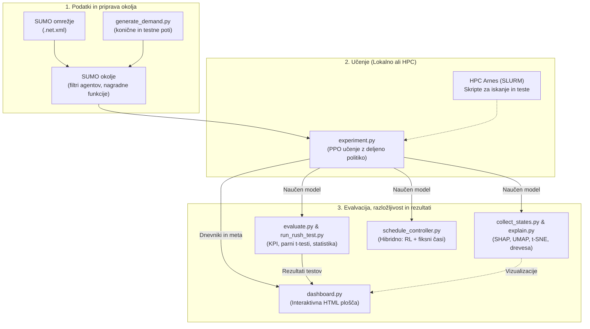
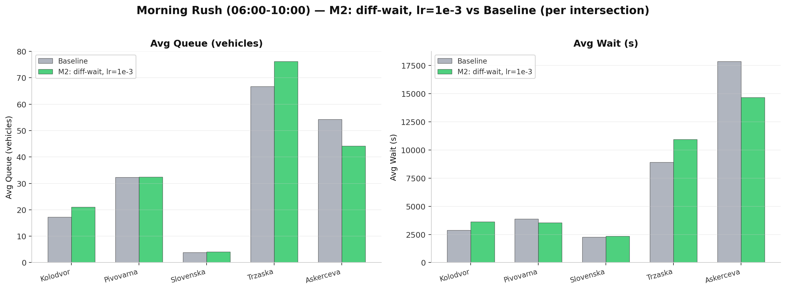
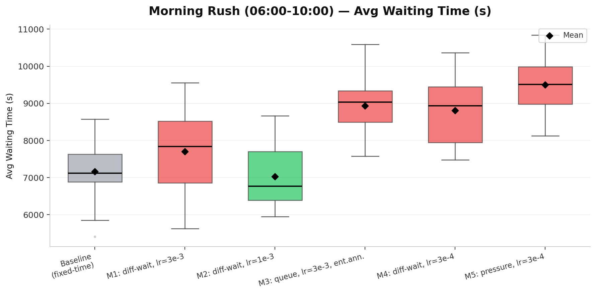
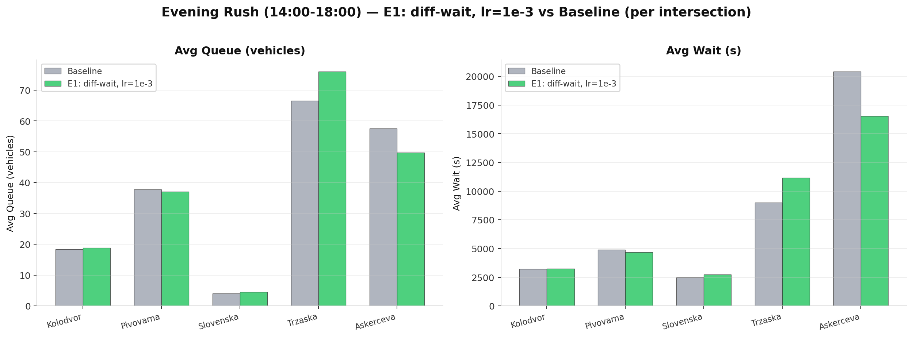
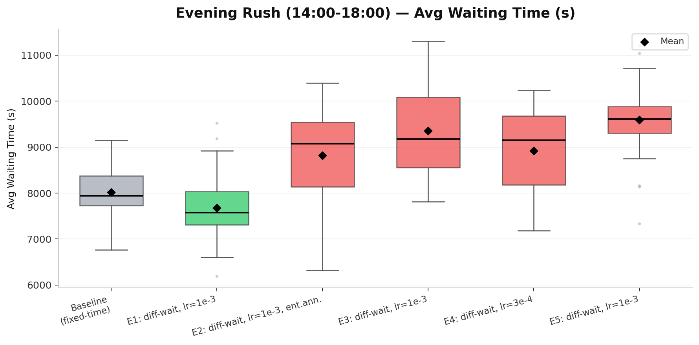
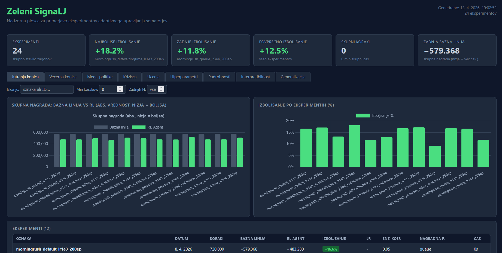

# Zeleni SignaLJ

**Optimizacija semaforjev z umetno inteligenco za Ljubljano**

Arnes HackathON 2026 | Ekipa Ransomware

[](https://doi.org/10.5281/zenodo.19582380)

## Pregled

Agenti s spodbujevalnim učenjem (neodvisni PPO z deljeno politiko), učeni v simulatorju SUMO, za optimizacijo krmiljenja semaforjev v ljubljanskem Bleiweisovem trikotniku — območju zlivanja Tržaške, Celovške in Dunajske ceste.

## Ciljno območje

Zaradi kompleksnosti optimizacije večjega območja smo se osredotočili na optimizacijo le 5 križišč. Želimo narediti prototip, ki dokaže, da se promet lahko optimizira, seveda bi pa v realnosti naredili optimizacijo na nivoju območja.

Opazujemo sledeča križišča:
1. **Tivolska / Slovenska / Dunajska / Trg OF** (Kolodvor)
2. **Bleiweisova / Tivolska / Celovška / Gosposvetska** (Pivovarna)
3. **Slovenska / Gosposvetska / Dalmatinova** (Slovenska)
4. **Aškerčeva / Prešernova / Groharjeva** (Tržaška)
5. **Aškerčeva / Zoisova / Slovenska / Barjanska** (Aškerčeva)


Preostalih 32 semaforjev v omrežju ohranja izvorne SUMO programe (fiksne cikle iz .net.xml), kar zagotavlja pošteno primerjavo z bazno linijo.

## Podatki o območju

Podatki o cestnem omrežju so pridobljeni iz OpenStreetMap (ODbL licenca).

**Okvir (bounding box):**
| Stran | Koordinata |
|-------|------------|
| Sever | 46.05840 |
| Jug | 46.04540 |
| Zahod | 14.49385 |
| Vzhod | 14.50687 |

**Vir:** [OpenStreetMap Export](https://www.openstreetmap.org/export)

Podatke je mogoče ponovno prenesti z Overpass API:
```bash
wget -O data/osm/map.osm \
  "https://overpass-api.de/api/map?bbox=14.49385,46.04540,14.50687,46.05840"
```

## Hiter začetek

Testirano v WSL2 Ubuntu24.04 s Python 3.12
```bash
# 1. Namestitev SUMO
sudo add-apt-repository ppa:sumo/stable
sudo apt-get update && sudo apt-get install -y sumo sumo-tools sumo-doc
export SUMO_HOME="/usr/share/sumo"

# 2. Ustvarjanje Python okolja
python3 -m venv .venv
source .venv/bin/activate
pip install -r requirements.txt

# 3. Preverjanje namestitve
python -c "import sumo_rl; print('sumo-rl', sumo_rl.__version__)"

# 3b. Pospešitev SUMO (5-8x hitrejše — uporabi libsumo namesto TraCI socketa)
export LIBSUMO_AS_TRACI=1

# 4a. Generiranje enakomerne prometne obremenitve (za testiranje)
python src/generate_demand.py --profile uniform --duration 3600 --peak_vph 800

# 4b. Generiranje prometnih scenarijev koničnih ur (za resno učenje)
python src/generate_demand.py --scenario all
# Ustvari: routes_morning_rush.rou.xml, routes_evening_rush.rou.xml, routes_offpeak.rou.xml

# 5. Učenje — enaka prometna obremenitev (lokalno, 50 epizod ~ 4 min)
python src/experiment.py --episode_count 50 --tag local_50ep

# 5b. Učenje — scenarij jutranje konice (ena pot, lokalno testiranje)
python src/experiment.py --scenario morning_rush --episode_count 50 --tag jutro_50ep

# 5c. Učenje z naključnimi potmi (priporočeno za produkcijo — prepreči preveliko prilagajanje)
python src/generate_demand.py --scenario morning_rush --num_variants 20 --output_dir data/routes/train-morning
python src/experiment.py --scenario morning_rush --episode_count 50 \
    --route_dir data/routes/train-morning --tag jutro_routerand_50ep

# 6. Primerjava rezultatov in nadzorna plošča
python src/experiment.py --compare_only
python src/dashboard.py
# Odpri results/dashboard.html v brskalniku

# 7. Evalvacija modela po vseh scenarijih koničnih ur
python src/evaluate.py --model results/experiments/XXXXX/ppo_shared_policy.zip
python src/evaluate.py --model models/ppo_morning_rush_final.zip --scenario morning_rush

# 8. Razložljivost modela (SHAP, odločitvena drevesa, UMAP, t-SNE)
python src/collect_states.py --model_path results/experiments/XXXXX/ppo_shared_policy.zip \
    --scenario morning_rush --episodes 12
python src/explain.py --data_path results/experiments/XXXXX/harvested_data.pkl
# Odpri results/experiments/XXXXX/explanations/ za slike
```

## Generiranje prometnega povpraševanja (`generate_demand.py`)

Dva načina uporabe: `--profile` za enakomerno testno obremenitev ali `--scenario` za realistične scenarije koničnih ur iz dvokoničnega 24h matematičnega modela (8:00 jutranja + 16:00 večerna konica). Scenariji modelirajo tudi smer prometnega toka: jutranja konica ima 70 % prometa usmerjenega v center, večerna konica pa 70 % iz centra.

```bash
# Enakomerna obremenitev (za hitre preizkuse / smoke tests)
python src/generate_demand.py --profile uniform --duration 3600 --peak_vph 800

# Vsi scenariji koničnih ur naenkrat (priporočeno za resno učenje)
python src/generate_demand.py --scenario all

# Posamezni scenariji
python src/generate_demand.py --scenario morning_rush   # 06:00-10:00, 4h, bimodalna krivulja
python src/generate_demand.py --scenario evening_rush   # 14:00-18:00, 4h, bimodalna krivulja
python src/generate_demand.py --scenario offpeak        # 12:00-13:00, 1h, referenčni scenarij
```

| Parameter | Opis |
|-----------|------|
| `--profile uniform` | Enakomerna obremenitev (za hitre preizkuse / smoke tests) |
| `--scenario` | `morning_rush` / `evening_rush` / `offpeak` / `all` |
| `--duration` | Trajanje simulacije v sekundah (samo `--profile` način) |
| `--peak_vph` | Koničen pretok v vozilih/uro (samo `--profile` način) |
| `--fringe_factor` | Verjetnost izvorov na robovih (privzeto 5.0) |

| Scenarij | Okno | Trajanje | Datoteka |
|----------|------|----------|---------|
| `morning_rush` | 06:00-10:00 | 4 ure | `routes_morning_rush.rou.xml` |
| `evening_rush` | 14:00-18:00 | 4 ure | `routes_evening_rush.rou.xml` |
| `offpeak` | 12:00-13:00 | 1 ura | `routes_offpeak.rou.xml` |

## Učenje (`experiment.py`)

Zažene bazno linijo → učenje → evalvacija → shranjevanje v enem klicu.

```bash
# Osnovna uporaba
python src/experiment.py --episode_count 50 --tag local_50ep

# Scenariji koničnih ur (zahteva routes_morning_rush.rou.xml)
python src/experiment.py --scenario morning_rush --episode_count 100 --tag jutro_100ep
python src/experiment.py --scenario evening_rush --episode_count 100 --tag vecer_100ep

# Curriculum learning — naključni urni rezini čez cel dan
python src/experiment.py --episode_count 200 --curriculum --tag curriculum_200ep

# Curriculum z beleženjem napredka (primerja RL z bazno linijo vsako epizodo)
python src/experiment.py --episode_count 100 --curriculum --log_curriculum --tag curriculum_log

# Nadaljevanje iz kontrolne točke
python src/experiment.py --episode_count 100 --resume results/experiments/XXXXX/ppo_shared_policy.zip

# Vzporedno učenje na več CPE (za HPC)
python src/experiment.py --episode_count 500 --num_cpus 4 --tag hpc_500ep

# Časovna omejitev (npr. 1 ura učenja)
python src/experiment.py --max_hours 1.0 --tag 1h_local

# Surovi timesteps (namesto epizod)
python src/experiment.py --total_timesteps 180000 --tag raw_50ep

# Samo primerjava obstoječih eksperimentov
python src/experiment.py --compare_only
```

| Zastavica | Opis |
|-----------|------|
| `--episode_count N` | Število polnih epizod (avtomatsko prilagojeno za scenarij in vzporednost) <br/> Epizoda: simulacija enega scenarija (bodisi jutranje/večerne konice ali 24h) |
| `--total_timesteps N` | Surovo število SB3 korakov |
| `--max_hours H` | Zaustavitev po H urah (stenski čas / wall time) |
| `--scenario` | `uniform` / `morning_rush` / `evening_rush` / `offpeak` |
| `--route_dir DIR` | Mapa z več `.rou.xml` datotekami — vsaka podprocesna SUMO instanca dobi svojo naključno pot |
| `--reward_fn` | `queue` / `pressure` / `diff-waiting-time` / `average-speed` |
| `--learning_rate F` | Hitrost učenja (privzeto: 1e-3) |
| `--ent_coef F` | Entropijski koeficient (privzeto: 0.05) |
| `--entropy_annealing` | Linearno zmanjšanje entropije od ent_coef do 0.01 |
| `--episodes_per_save N` | Kontrolna točka vsako N epizod (privzeto: 10) |
| `--curriculum` | Naključni urni rezini 24h krivulje |
| `--num_cpus N` | Vzporedni SUMO procesi (za HPC). Z N CPE se izvedejo N vzporednih epizod na PPO posodobitev; `batch_size` se avtomatsko skalira na `180*N` za ohranjanje ~20 mini-serij na epoho. |
| `--resume PATH` | Nadaljevanje iz obstoječe kontrolne točke |
| `--tag OZNAKA` | Oznaka eksperimenta (za identifikacijo) |

## Napredno učenje (Curriculum Learning)

Z uporabo zastavice `--curriculum` algoritem naključno vzorči različne ure dneva. Sistem izračuna prometni pretok iz dvokoničnega matematičnega modela (`demand_math.get_vph`): konici ob 8:00 in 16:00, ponoči skoraj prazne ceste. Skupno 40.000 vozil/dan (nastavljivo v `config.py` kot `TOTAL_DAILY_CARS`).

Model vsako epizodo vidi drugačen scenarij in se tako nauči splošnih pravil za različne prometne obremenitve. Z `--log_curriculum` dobimo podroben zapis napredka (primerjava RL vs. bazna linija za vsako epizodo) v `curriculum_progress.txt`.

## Evalvacija

Primerja naučen model z bazno linijo (fiksni časi) po treh scenarijih.

```bash
# Evalvacija čez vse tri scenarije
python src/evaluate.py --model results/experiments/XXXXX/ppo_shared_policy.zip

# Samo en scenarij
python src/evaluate.py --model models/ppo_morning_rush_final.zip --scenario morning_rush

# Z vizualizacijo SUMO GUI
python src/evaluate.py --model models/ppo_morning_rush_final.zip --gui

# Samo bazna linija (brez modela)
python src/evaluate.py
```

Izhod: `results/rush_hour_comparison.csv` (primerjava po scenarijih) + `results/comparison_summary.csv` (po križiščih).

## Razložljivost modela (Interpretability)

Dvostopenjski postopek za razlago naučene politike: zbiranje stanj iz modela, nato generiranje vizualizacij.

```bash
# 1. Zberi podatke iz modela (opazovanja, akcije, latentne aktivacije)
python src/collect_states.py --model_path results/experiments/XXXXX/ppo_shared_policy.zip \
    --scenario morning_rush --episodes 12

# 2. Generiraj razlage (SHAP, odločitvena drevesa, UMAP, t-SNE)
python src/explain.py --data_path results/experiments/XXXXX/harvested_data.pkl
# -> results/experiments/XXXXX/explanations/
```

Štiri vrste vizualizacij za vsako od 5 križišč:
- **Nadomestno odločitveno drevo** — plitvo drevo (globina 4) kot človeku berljiv nadomestek PPO politike. Listni vozlišči kažejo smerne skupine (npr. "Smer 1 + Smer 3"), notranja vozlišča pa pogoje v slovenščini. Pokritost PPO (fidelity) prikazana z značko.
- **SHAP atribucija značilk** — beeswarm diagram kaže, katere značilke (gostota pasu, dolžina vrste, čas dneva) najbolj vplivajo na izbiro akcije.
- **UMAP projekcija** — 64-dim latentni prostor PPO mreže projiciran v 2D. Barvanje po akciji, uri dneva in križišču razkrije, ali model loči prometne režime. UMAP se osredotoča na ohranjanje globalne strukture.
- **t-SNE projekcija** — alternativna 2D projekcija latentnega prostora PPO mreže. V primerjavi z UMAP se t-SNE bolj osredotoča na ohranjanje lokalnih sosesk in razkriva finejše lokalne gruče podobnih prometnih stanj.

Priporočeno 10-15 epizod za stabilne SHAP vrednosti in čiste UMAP/t-SNE grozde (~36.000-54.000 podatkovnih točk).

## Načrtovalec (Schedule Controller)

`schedule_controller.py` implementira produkcijsko strategijo: RL agent se aktivira samo v koničnih urah, sicer tečejo izvorni SUMO programi.

| Čas | Način |
|-----|-------|
| 00:00-06:00 | Fiksni čas (noč) |
| 06:00-10:00 | RL agent (jutranja konica) |
| 10:00-14:00 | Fiksni čas (poldnevi) |
| 14:00-18:00 | RL agent (večerna konica) |
| 18:00-24:00 | Fiksni čas (večer/noč) |

```python
from schedule_controller import ScheduleController
ctrl = ScheduleController(
    model_morning="models/ppo_morning_rush_final.zip",
    model_evening="models/ppo_evening_rush_final.zip"
)
ctrl.print_schedule()
mode = ctrl.get_mode(hour=7.5)   # -> "rl_morning"
```

## Arhitektura cevovoda



## Parametri simulacije

Nastavitve se lahko spreminja v `config.py`.

| Parameter | Vrednost | Opis |
|-----------|----------|------|
| `num_seconds` | 3600 + 600 | Trajanje epizode: 600s ogrevanje + 1h RL |
| `delta_time` | 5 | Sekunde med odločitvami agenta (frekvenca akcij) |
| `yellow_time` | 2 | Trajanje rumene faze med preklopom zelene |
| `min_green` | 10 | Minimalen čas zelene faze pred preklopom |
| `max_green` | 90 | Maksimalen čas zelene faze pred ponovnim odločanjem |
| `reward_fn` | "queue" | Nagrada = negativno število ustavljenih vozil na korak |
| `WARMUP_SECONDS` | 600 | 10 min mehanske SUMO simulacije pred RL prevzemom (Čas da se vozila razporedijo po cestah) |

## PPO hiperparametri 

Nastavitve se lahko spreminja v `config.py`.

| Parameter | Vrednost | Opis |
|-----------|----------|------|
| `learning_rate` | 0.001 | Korak gradientnega posodabljanja |
| `n_steps` | 720 | Korakov na okolje pred PPO posodobitvijo |
| `batch_size` | 180 | Avtomatsko skalirano: `180 * num_cpus` za ohranjanje ~20 mini-serij na epoho |
| `n_epochs` | 10 | Število prehodov čez zbiralnik na posodobitev |
| `gamma` | 0.99 | Diskontni faktor (0=kratkovidno, 1=neskončen horizont) |
| `gae_lambda` | 0.95 | GAE glajenje med pristranskostjo in varianco |
| `ent_coef` | 0.05 | Entropijski bonus — spodbuja raziskovanje |
| `clip_range` | 0.2 | PPO obrezovanje: omejuje spremembo politike na posodobitev |

## Razumevanje korakov (timesteps)

En SB3 korak = 5 s simuliranega prometa za 1 semafor. S 5 semaforji: `1 epizoda (1h) = 3600/5 * 5 = 3600 korakov`, `1 epizoda (4h rush) = 14400 korakov`.

Z `--num_cpus N`: N vzporednih SUMO simulacij, `batch_size` avtomatsko skaliran na `180*N`, `--episode_count` pretvorjen v `ceil(episode_count/N)` PPO posodobitev.

| `--episode_count` | `--num_cpus` | PPO posodobitev | Vzporednih epizod |
|-------------------|--------------|------------------|--------------------|
| 50 | 1 | 50 | 50 |
| 50 | 4 | 13 | 52 |
| 300 | 128 | 3 | 384 |
| 500 | 128 | 4 | 512 |

## Struktura projekta

```
zeleni-signalj/
├── data/
│   ├── osm/              # Surovi OSM izvlečki
│   ├── networks/         # SUMO .net.xml datoteke
│   ├── routes/           # Prometno povpraševanje .rou.xml
│   └── gtfs/             # LPP avtobusni podatki (neobvezno)
├── src/
│   ├── experiment.py         # Celoten eksperiment (bazna linija → učenje → evalvacija)
│   ├── evaluate.py           # Multi-scenarij evalvacija (morning/evening/offpeak)
│   ├── run_24h.py            # 24h simulacija z dinamičnim RL/fiksni čas preklapljanjem
│   ├── run_rush_test.py      # Izoliran test generalizacije koničnih ur (50 poti x model)
│   ├── config.py             # ID-ji križišč, parametri simulacije, PPO hiperparametri
│   ├── agent_filter.py       # PettingZoo ovoj za filtriranje na 5 križišč
│   ├── tls_programs.py       # Obnovitev izvornih SUMO programov za neopazovana križišča
│   ├── custom_reward.py      # Prilagojene nagradne funkcije
│   ├── demand_math.py        # Dvokonična 24h prometna krivulja (get_vph)
│   ├── generate_demand.py    # Generiranje povpraševanja (uniform + scenariji + full_day)
│   ├── schedule_controller.py  # Načrtovalec: RL v konicah, fiksni čas drugače
│   ├── eval_helper.py        # Pomočnik za evalvacijo v podprocesih (curriculum)
│   ├── collect_states.py      # Zbiranje stanj in latentnih aktivacij iz naučenega modela
│   ├── explain.py             # Razložljivost: SHAP, odločitvena drevesa, UMAP, t-SNE
│   ├── analyze_sim.py         # Analiza SUMO izhoda (teleporti, pretoki)
│   └── dashboard.py           # HTML nadzorna plošča (zavihki: scenariji, generalizacija, razložljivost)
├── hpc/
│   ├── common.sh             # Skupna HPC nastavitev (venv, SUMO_HOME)
│   ├── traffic_rl.def        # Apptainer definicija vsebnika
│   ├── sweep/                # Hiperparametrsko iskanje (44 SLURM skript)
│   │   ├── generate_jobs.py  # Generator SLURM skript
│   │   ├── submit_all.sh     # Oddaja z dvofaznim cevovodom (poti → učenje)
│   │   ├── gen_train_routes.slurm  # Generiranje 100+100 učnih poti (faza 1)
│   │   └── *.slurm           # Posamezne učne skripte (faza 2)
│   └── statistical-test/     # Statistično testiranje (konični testi generalizacije)
│       ├── generate_rush_jobs.py  # Generator SLURM skript za konične teste
│       ├── submit_rush.sh         # Oddaja koničnih testov
│       ├── gen_routes_morning_rush.slurm  # Generiranje 50 poti za jutranji test
│       ├── gen_routes_evening_rush.slurm  # Generiranje 50 poti za večerni test
│       └── rush_*.slurm           # 6 modelov + 2 bazni liniji (konični testi)
├── models/               # Shranjeni modeli (kontrolne točke)
├── logs/                 # Dnevniki učenja
└── results/
    ├── experiments/      # Rezultati po eksperimentih
    │   └── <run_id>/     # meta.json, results.csv, ppo_shared_policy.zip
    │       └── checkpoints/  # ppo_policy_10ep.zip + .json, ppo_policy_20ep.zip + .json, ...
    ├── statistical-test/ # Rezultati testov generalizacije koničnih ur
    │   ├── M1_morning/   # meta.json + 50x run_seed_*.json + summary.csv
    │   ├── ...           # M2_morning, M3_morning, E1_evening, ..., E3_evening
    │   ├── baseline_morning/  # Bazna linija (jutranja konica)
    │   └── baseline_evening/  # Bazna linija (večerna konica)
    ├── rush_hour_comparison.csv  # KPI primerjava po scenarijih koničnih ur
    ├── comparison_summary.csv    # KPI po posameznih križiščih
    └── dashboard.html    # Interaktivna nadzorna plošča (9 zavihkov)
```

## Tehnologije

- **Python 3.12** - Programski jezik
- **SUMO 1.26.0** — mikroskopski prometni simulator (DLR)
- **sumo-rl 1.4.5** — PettingZoo ovoj za SUMO (več-agentno)
- **stable-baselines3 2.8.0** — implementacija PPO algoritma
- **SuperSuit 3.9+** — vektorizacija PettingZoo okolja za SB3
- **HPC Arnes** (SLING) — superračunalnik za učenje z večjim številom epizod

## HPC eksperimenti

### Iskanje 1 (zaključeno): Učenje na eni poti

Prvo iskanje: 24 konfiguracij x 200 epizod na 128 CPE-jih. Modeli so se učili na eni sami prometni poti na scenarij. Najboljši modeli so dosegli 12–18 % izboljšanje na učni poti, vendar niso posplošili na nevidene prometne vzorce (potrjeno s testi generalizacije koničnih ur: -15 % do -27 % poslabšanje na naključnih poteh).

### Iskanje 2 (zaključeno): Učenje z naključnimi potmi

44 SLURM skript v `hpc/sweep/`, generirane z `hpc/sweep/generate_jobs.py`. Vse uporabljajo `--route_dir` s 50 naključnimi prometnimi potmi na scenarij, da preprečijo preveliko prilagajanje na izvorno-ciljne pare (OD-pair overfitting). S 300 epizodami in naključno izbiro vsaka pot dobi ~6 ponovitev — dovolj za utrjevanje vzorcev brez memorizacije posameznih poti.

**Matrika eksperimentov:**
- 3 nagradne funkcije: `queue`, `pressure`, `diff-waiting-time`
- 3 hitrosti učenja: `3e-3`, `1e-3`, `3e-4`
- 2 scenarija: `morning_rush`, `evening_rush`
- Entropy annealing variante (vseh 18 kombinacij)
- Iskanje entropijskega koeficienta (`ent_coef` = 0.02, 0.1 za `pressure`, 0.05 je privzet in že v osnovnem iskanju)
- 300 epizod, 24h časovna omejitev, 128 CPE-jev
- `batch_size` avtomatsko skaliran na `180*128 = 23.040` (ohranja 20 mini-serij na epoho)
- PPO posodobitve: `ceil(300/128) = 3` posodobitve, vsaka zbere 128 vzporednih epizod
- Vsaka podprocesna SUMO instanca dobi svojo naključno pot iz `--route_dir` (raznolikost znotraj zbiralnika)

**Dvofazni cevovod:**
1. `gen_train_routes.slurm` — generira 50 jutranjih + 50 večernih prometnih poti
2. Vseh 44 učnih skript počaka na poti, nato teče vzporedno

**Kontrolne točke:** Vsako 10. epizodo se shrani `ppo_policy_Nep.zip` z metapodatki (`.json`). Tudi ob prekinitvi se shrani `ppo_model_latest.zip`.

```bash
# Oddaj vse (generiranje poti + učenje)
bash hpc/sweep/submit_all.sh

# Preskoči generiranje poti (če poti že obstajajo)
bash hpc/sweep/submit_all.sh --skip-routes

# Filtriraj po ključni besedi
bash hpc/sweep/submit_all.sh pressure
bash hpc/sweep/submit_all.sh morningrush
bash hpc/sweep/submit_all.sh lr1e3
bash hpc/sweep/submit_all.sh entanneal

# Spremljaj status
squeue -u $USER
```

## Izbor najboljših politik (Iskanje 1 — ena pot)

Po izvedbi 24 eksperimentov na HPC (3 nagradne funkcije x 2 hitrosti učenja x 2 scenarija + entropy annealing variante) smo na podlagi nadzorne plošče izbrali **3 najboljše politike za jutranjo konico** in **3 najboljše za večerno konico** glede na izboljšanje % nad bazno linijo (fiksni časi). Ti modeli so se učili na eni sami prometni poti in niso posplošili na nevidene prometne vzorce.

### Najboljše politike — jutranja konica (06:00-10:00)

| Rang | Nagradna funkcija | Hitrost učenja | Izboljšanje |
|------|-------------------|----------------|-------------|
| M1 | diff-waiting-time | 1e-3 | **+18,2 %** |
| M2 | pressure | 1e-3 | **+17,2 %** |
| M3 | queue (privzeta) | 3e-4 | **+17,1 %** |

### Najboljše politike — večerna konica (14:00-18:00)

| Rang | Nagradna funkcija | Hitrost učenja | Entropy annealing | Izboljšanje |
|------|-------------------|----------------|-------------------|-------------|
| E1 | pressure | 1e-3 | da | **+15,1 %** |
| E2 | diff-waiting-time | 1e-3 | da | **+15,0 %** |
| E3 | pressure | 3e-4 | da | **+12,9 %** |

## Rezultati: Najboljša modela (Iskanje 2 — naključne poti, 3200 epizod)

Po drugem iskanju (44 konfiguracij x 3200 epizod na 16 CPE-jih, učenje z naključnimi potmi) smo izbrali najboljša modela na podlagi izboljšanja pri učenju:

| Scenarij | Model | Nagradna funkcija | LR | Izboljšanje (učenje) |
|----------|-------|-------------------|----|----------------------|
| Jutranja konica (06:00-10:00) | `morningrush_diffwaitingtime_lr1e3_3200ep` | diff-waiting-time | 1e-3 | +1,57 % |
| Večerna konica (14:00-18:00) | `eveningrush_diffwaitingtime_lr1e3_3200ep` | diff-waiting-time | 1e-3 | +8,16 % |

### Statistično testiranje generalizacije (50-semeni parni testi)

Za preverjanje, ali modela posplošita na nevidene prometne vzorce, smo izvedli 50 neodvisnih testov z različnimi prometnimi potmi. Vsak test primerja RL model z bazno linijo (fiksni časi) na isti prometni poti — razlike izhajajo izključno iz strategije krmiljenja.

#### Jutranja konica (`morningrush_diffwaitingtime_lr1e3_3200ep`)

| Metrika | Vrednost |
|---------|----------|
| Skupna nagrada vs. bazna linija | **-1,99 %** (rahlo slabše) |
| Izboljšanje čakalnega časa | **+1,84 %** |
| Parni t-test (p-vrednost) | 0,092 (ni statistično značilno pri alpha=0,05) |
| Cohenov d | -0,243 (majhen učinek) |

**Rezultati po križiščih:**

| Križišče | Izboljšanje nagrade |
|----------|---------------------|
| Aškerčeva | **+18,48 %** |
| Pivovarna | -0,12 % |
| Slovenska | -5,08 % |
| Tržaška | -14,14 % |
| Kolodvor | -22,13 % |





#### Večerna konica (`eveningrush_diffwaitingtime_lr1e3_3200ep`)

| Metrika | Vrednost |
|---------|----------|
| Skupna nagrada vs. bazna linija | **-1,11 %** (rahlo slabše) |
| Izboljšanje čakalnega časa | **+4,29 %** |
| Parni t-test (p-vrednost) | 0,187 (ni statistično značilno pri alpha=0,05) |
| Cohenov d | -0,189 (majhen učinek) |

**Rezultati po križiščih:**

| Križišče | Izboljšanje nagrade |
|----------|---------------------|
| Aškerčeva | **+13,40 %** |
| Pivovarna | **+1,80 %** |
| Kolodvor | -2,65 % |
| Slovenska | -13,35 % |
| Tržaška | -14,13 % |





### Interpretacija rezultatov

Modeli z naključnimi potmi (Iskanje 2) kažejo bistveno boljšo posplošitev kot modeli z eno potjo (Iskanje 1, ki so se poslabšali za -15 % do -27 %). Modeli iz Iskanja 2 so primerljivi z bazno linijo po skupni nagradi, z manjšim izboljšanjem čakalnih časov. Izboljšanja niso statistično značilna (p > 0,05).

**Ključna ugotovitev:** Agent dosledno izboljša Aškerčevo, a poslabša Tržaško in Kolodvor. To nakazuje, da deljena politika (en model za 5 križišč) težko optimizira vsa križišča hkrati — izboljšanje enega lahko poslabša sosednje. Prihodnje delo bi raziskalo ločene politike ali hierarhično koordinacijo.

## Nadzorna plošča (Dashboard)

Interaktivna HTML nadzorna plošča (`results/dashboard.html`) za pregled vseh eksperimentov. Zgornji del prikazuje KPI kartice (število eksperimentov, najboljše izboljšanje, povprečno izboljšanje, skupna nagrada bazne linije), spodaj pa interaktivne grafe s filtriranjem po scenariju in oznaki.



```bash
python src/dashboard.py --no-prompt
# Odpri results/dashboard.html v brskalniku
```

| Zavihek | Vsebina |
|---------|---------|
| **Jutranja / Večerna konica** | Primerjava eksperimentov za posamezen scenarij: stolpični diagram nagrad, izboljšanje % po eksperimentih |
| **Križišča** | Razdelitev po 5 križiščih: nagrada in izboljšanje za vsako križišče posebej |
| **Učenje** | Krivulje učenja (nagrada skozi epizode) za izbrane eksperimente |
| **Hiperparametri** | Razsevni diagrami (LR vs. izboljšanje, nagradna fn vs. izboljšanje) |
| **Podrobnosti** | Metapodatki, hiperparametri in rezultati posameznega eksperimenta |
| **Generalizacija** | 50-semeni statistični testi: CI diagrami, box ploti, primerjava po križiščih |
| **Razložljivost** | SHAP diagrami, odločitvena drevesa in UMAP in t-SNE projekcije za najboljše modele |

## Prihodnje izboljšave

Na podlagi rezultatov identificiramo več smeri za nadaljnje delo:

### Arhitektura modela

- **Ločeni modeli po križiščih** — trenutna deljena politika (en PPO model za 5 križišč) težko optimizira vsa križišča hkrati (Aškerčeva se izboljša, Tržaška in Kolodvor se poslabšata). Ločeni modeli ali hierarhična večagentna arhitektura (npr. QMIX, MAPPO) bi omogočila križišču-specifične politike.
- **Večji model ali drugačna arhitektura** — privzeta 2-slojna MLP mreža (64 nevronov) je majhna. Večja mreža ali arhitektura z mehanizmom pozornosti (attention) bi bolje zajela medkrižiščne odvisnosti.
- **Multi-objektna nagradna funkcija** — kombinacija čakalnih vrst, čakalnega časa in prepustnosti (throughput) namesto enojne metrike, z utežmi prilagojenimi po križišču.

### Učenje in generalizacija

- **Več prometnih scenarijev** — učenje na več kot 50 naključnih poteh, vključno z nesrečami, zaprtji cest in posebnimi dogodki (tekme, koncerti).
- **Realni prometni podatki** — uporaba indukcijskih zank ali kamer za kalibracijo SUMO simulatorja namesto sintetičnih poti iz randomTrips.
- **Curriculum z naraščajočo težavnostjo** — postopno povečevanje prometne obremenitve od lahkih do koničnih scenarijev, namesto naključnega vzorčenja.
- **Daljše učenje** — trenutne politike so učene z le 3 PPO posodobitvami (3200 epizod / 128 CPE). Večje število posodobitev bi morda omogočilo konvergenco.

### Simulacijsko okolje

- **Večje omrežje** — razširitev s 5 na 15-20 križišč v širši okolici Bleiweisovega trikotnika za zajem kaskadnih učinkov.
- **Javni prevoz** — vključitev prednostne obravnave avtobusov LPP (Slovenska cesta je že namenjena avtobusom) in koordinacija z RL agenti.
- **Pešci in kolesarji** — dodajanje pešcev in kolesarskih tokov v simulacijo za realističnejše fazne omejitve.

### Produkcijska uvedba

- **Sim-to-real prenos** — preizkus naučenega agenta na realnem krmilniku semaforjev (npr. z NTCIP protokolom) v nadzorovanem okolju.
- **Robustnost na motnje** — testiranje obnašanja agenta ob izpadu senzorjev, komunikacijskih napakah ali neobičajnih prometnih vzorcih.
- **Stalno učenje (online RL)** — posodabljanje politike v realnem času na podlagi dejanskih prometnih podatkov.

## Ekipa

- Nik Jenič
- Tian Ključanin
- Nace Omahen
- Maša Uhan
